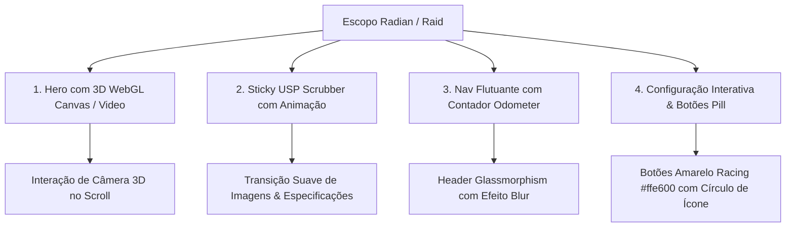

# Análise de Escopo 3D & Rebranding Z8 E-motion (Baseado na Pasta Raid / Radian)

Este documento realiza a desconstrução técnica do escopo visual, componentes 3D e animações da marca **Radian EXR** (encontrados na pasta `Raid/`) e estabelece as diretrizes de reconstrução do novo **Branding de Luxo Z8 E-motion**.

---

## 🔍 1. Desconstrução do Escopo 3D & UX da Radian (Pasta Raid)

### **1.1. Arquitetura Visual & Paleta Radian**
- **Fundo Cinematográfico Escuro**: `#090a0d` (Obsidiana) e `#0f1217` (Grafite Escuro).
- **Cor de Ação Primária**: `#ffe600` (Amarelo Racing / Volt Yellow) — Usado em botões de conversão e métricas de destaque.
- **Cor de Ação Secundária**: `#00f0ff` (Ciano Elétrico) — Usado em detalhes de conectividade e halos de luz LED.
- **Tipografia**: Títulos em caixa alta ou baixa de peso 800 (bold), linha de texto ajustada (tight line-height: `1.1`), subtítulos em tom slate `#94a3b8` e marcadores técnicos em código monospaçado.

---

## 🎨 2. Diretrizes do Novo Rebranding Z8 E-motion (Vibe Radian)

### **2.1. O Novo Hero 3D em Tempo Real (WebGL Three.js)**
Diferente de sites estáticos, a Z8 E-motion adota um **Canvas WebGL 3D em tempo real no Hero**:
- A moto 3D (Z8 Tank / Syuan) é renderizada diretamente no canvas principal da tela inicial.
- Movimentos leves do mouse ou rolagem do scroll rotacionam suavemente o ângulo de visão do veículo em 360°.
- Efeito de profundidade com luz de holofote (*spotlight*) e reflexos realistas no piso espelhado.

### **2.2. Barra de Navegação HUD Flutuante**
- **Efeito**: `backdrop-filter: blur(16px)` com borda fina translúcida e cantos arredondados (`border-radius: 40px`).
- **Contador Odometer**: Indicador dinâmico de seção (ex: `01 / 09 Overview`, `02 / 09 Performance`, `03 / 09 Exclusividade`).
- **Pill Buttons com Hover Magnético**: Botões no formato pílula com círculo interno que desliza a seta em animação fluida.

---

## 📂 3. Mapeamento dos Ativos Extraídos da Pasta `Raid`

Todos os ativos de alta resolução extraídos da pasta `Raid/` foram organizados em [`public/assets/raid/`](file:///c:/Users/LENOVO/Desktop/Z8/public/assets/raid/):
- `Parallax Motor.webp` & `Background - Desktop.webp`: Camadas de parallax e profundidade 3D.
- `1 Swap.webp`, `2 Power.webp`, `3-radian.webp`, `4 silence.webp`, `5 maintenance.webp`, `6 - app.webp`, `7 - design.webp`: Mídias em altíssima definição para o recurso de *Feature Scrubber*.
- `radian-demo.shared.64e4676ca.min.css` & `58246.css`: Estilos e variáveis de animação Radian.
