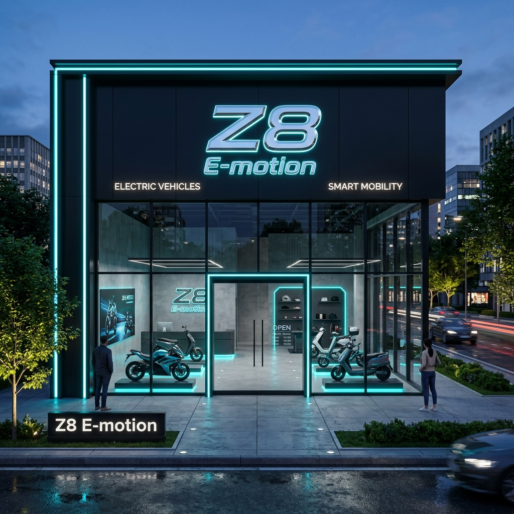
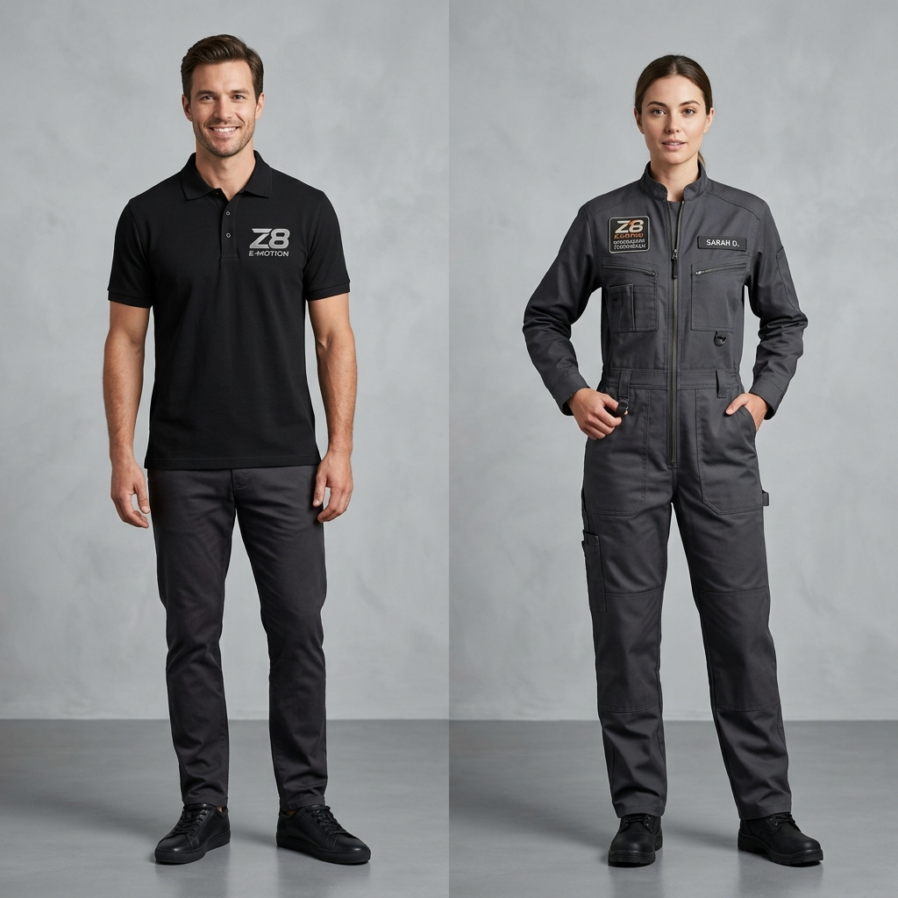
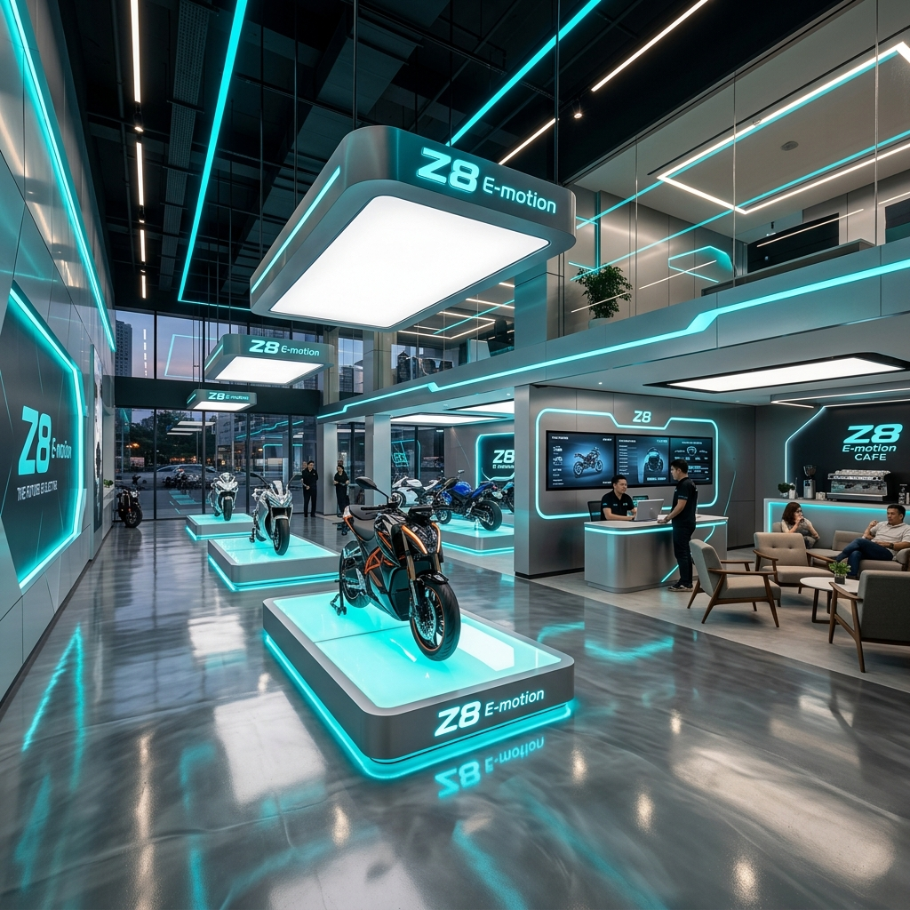

# Brandbook Oficial da Franquia Z8 E-motion®



O **Brandbook Oficial da Z8 E-motion®** reúne todas as diretrizes de identidade visual, arquitetura de loja, mockups de uniformes, sinalização e padrões técnicos para a homologação e operação de franquias em todo o Brasil.

---

## 🎨 1. Diretrizes da Logo & Identidade Visual

### **1.1. Logotipo Oficial em Alumínio Escovado**

O logotipo Z8 E-motion foi concebido em alumínio escovado tridimensional com cortes dinâmicos de alta velocidade.

- **Logo Principal (Horizontal)**: [`logos (1)_page_1.png`](../../public/assets/logos/logos%20(1)_page_1.png)
- **Logo 3D em Perspectiva**: [`logos (2)_page_1.png`](../../public/assets/logos/logos%20(2)_page_1.png)

```
       +---------------------------------------------+
       |                                             |
       |             [ MARGEM DE SEGURANÇA ]          |
       |     +---------------------------------+     |
       |     |   Z8 E-motion (Emblema Metal)   |     |
       |     +---------------------------------+     |
       |             [ MARGEM DE SEGURANÇA ]          |
       |                                             |
       +---------------------------------------------+
```

### **1.2. Usos Incorretos Proibidos**
- ❌ Nunca alterar a proporção de altura/largura da logo Z8.
- ❌ Nunca aplicar cores fluorescentes não aprovadas (ex: rosa, roxo) na logo metálica.
- ❌ Nunca retirar a palavra "E-motion" do conjunto da marca em lojas franqueadas.

### **1.3. Paleta de Cores Esqueuomórfica**
- **Ciano Elétrico (Volt Cyan)**: `RGB(0, 240, 255)` | `HEX #00F0FF`
- **Verde Volt (Volt Green)**: `RGB(16, 185, 129)` | `HEX #10B981`
- **Titânio Escovado**: `RGB(44, 53, 69)` | `HEX #2C3545`
- **Obsidiana Profunda**: `RGB(15, 18, 23)` | `HEX #0F1217`
- **Dourado Franquia Exclusiva**: `RGB(251, 191, 36)` | `HEX #FBBF24`

---

## 👕 2. Mockups de Uniformes & Vestuário da Franquia



### **2.1. Consultor de Vendas (Showroom)**
- Camisa Pólo Piquet Premium na cor **Preto Obsidiana**.
- Logotipo Z8 E-motion bordado em fio prateado metálico de alta densidade no peito esquerdo.
- Palavra "CONSULTOR" impressa em serigrafia cinza titânio na manga direita.

### **2.2. Técnico da Oficina Credenciada**
- Macacão profissional de mecânica em **Cinza Titânio**.
- Patch emborrachado 3D com a marca Z8 E-motion no peito e costas com a inscrição "TÉCNICO CERTIFICADO".
- Tecido reforçado anti-rasgo com bolsos para ferramentas de precisão.

---

## 🏬 3. Arquitetura de Loja Autorizada & Interiores



O projeto arquitetônico das lojas franqueadas Z8 E-motion combina o estilo esqueuomórfico industrial com acabamentos de altíssimo luxo:

- **Piso**: Resina epóxi autonivelante na cor Cinza Titânio com linhas guia na cor Verde Volt.
- **Expositores Elevados**: Ilhas com moldura de iluminação LED Ciano embutida sob a base para destacar modelos topo de linha (Z8 Tank 80km/h e FX-10).
- **Balcão de Atendimento**: Balcão metálico com acabamento escovado e painéis LCD com orçamentos em tempo real.

Para acessar as plantas e cotas completas, consulte o [Manual de Arquitetura e Planta Baixa](MANUAL_ARQUITETURA_E_PLANTA_BAIXA.md).

---

## 📑 4. Documentação Técnica Integrada

1. [Manual de Arquitetura & Planta Baixa da Loja](MANUAL_ARQUITETURA_E_PLANTA_BAIXA.md)
2. [Especificações Técnicas, Esquema Elétrico & VIN](ESPECIFICACOES_TECNICAS_E_HOMOLOGACAO.md)
3. [Checklist de Homologação SENATRAN/INMETRO](../../.gemini/antigravity/brain/482dd595-9727-4df8-b527-2545e88d0d6e/guia_homologacao_compliance_z8.md)
4. [Playbook de Franquias & Modelo Comercial](../../.gemini/antigravity/brain/482dd595-9727-4df8-b527-2545e88d0d6e/guia_de_marca_z8_emotion.md)
