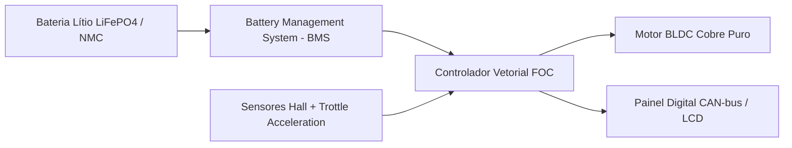

# Especificações Técnicas, Esquema Elétrico & Homologação Z8 E-motion

Este manual contém a documentação técnica avançada dos veículos da linha **Z8 E-motion**, servindo de referência para engenheiros, vistoriadores do DETRAN, mecânicos credenciados e auditores de compliance.

---

## ⚡ 1. Arquitetura do Sistema Propulsor Elétrico



### **1.1. Especificações dos Motores BLDC & Limitação de Velocidade**
- **Velocidade Máxima Padronizada**: Limitada eletronicamente em **32 km/h** em conformidade estrita com a Resolução CONTRAN nº 996/2023 (dispensa CNH e emplacamento para uso urbano e ciclovias).
- **Motor 1000W High Torque**: Presente nas linhas Z8 Tank, FX-10, Harley X21, U2 Delivery, N95C, N7, Q10, N710 e Q11.
- **Motor 500W High Efficiency**: Presente nas linhas Z8 Diamond Luxe e Z8 GS-005 Base Norte.

### **1.2. Química de Baterias & BMS**
- **Baterias de Lítio (NMC / LiFePO4)**:
  - Tensão Nominal: 48V / 60V / 72V.
  - Capacidade: 20Ah (Autonomia de até 40km).
  - Ciclos de Vida: > 2.000 ciclos com retenção de 80% da capacidade.
  - **BMS Inteligente**: Proteção contra sobrecarga, sobredosagem, curto-circuito, desbalanceamento de células e desligamento térmico a 65°C.
- **Baterias de Chumbo-Ácido Seladas (VRLA/AGM)**:
  - Tensão: 48V / 60V / 72V (20Ah).
  - Autonomia média: 30km a 40km.

---

## 🔍 2. Decodificação do Chassi (VIN de 17 Dígitos)

Todo veículo Z8 E-motion possui gravado no tubo da caixa de direção um número de chassi universal padronizado (ISO 3779 / CONTRAN):

```
Exemplo VIN:  9 Z 8  E M 1 2 3 4  R  A  0 0 0 1 0 1
Posição:      1 2 3  4 5 6 7 8 9 10 11 12 13 14 15 16 17
              \---/  \-------/ |  |  \-----------/
               WMI     VDS     |  |       VIS
```

- **Posição 1-3 (WMI - World Manufacturer Identifier)**: `9Z8` (Identificador de Importador/Fabricante Z8 no Brasil).
- **Posição 4-8 (VDS - Vehicle Descriptor Section)**: `EM123` (Código do Modelo, ex: Tank, FX-10, N7).
- **Posição 9 (Dígito Verificador)**: Dígito matemático de validação.
- **Posição 10 (Ano do Modelo)**: `R` (2024), `S` (2025), `T` (2026).
- **Posição 11 (Planta de Montagem)**: `A` (Fábrica Principal), `B` (CKD Brasil).
- **Posição 12-17 (VIS - Número de Série)**: Sequencial de produção de 6 dígitos.

---

## 📄 3. Checklist de Homologação & Emplacamento no DETRAN

```checklist
- [x] Laudo de Frenagem e Estabilidade (Conforme ABNT NBR / ISO veicular)
- [x] Memorial Descritivo assinado por Engenheiro Mecânico (ART CREA)
- [x] Concessão do Certificado de Adequação à Legislação de Trânsito (CAT SENATRAN)
- [x] Pré-cadastro do VIN no sistema SISCOLSWING / RENAVAM
- [x] Emissão de Nota Fiscal com indicação clara do Código Marca/Modelo/Versão
- [x] Selo de Licenciamento Ambiental IBAMA / CONAMA 401/2008 para Baterias
```
