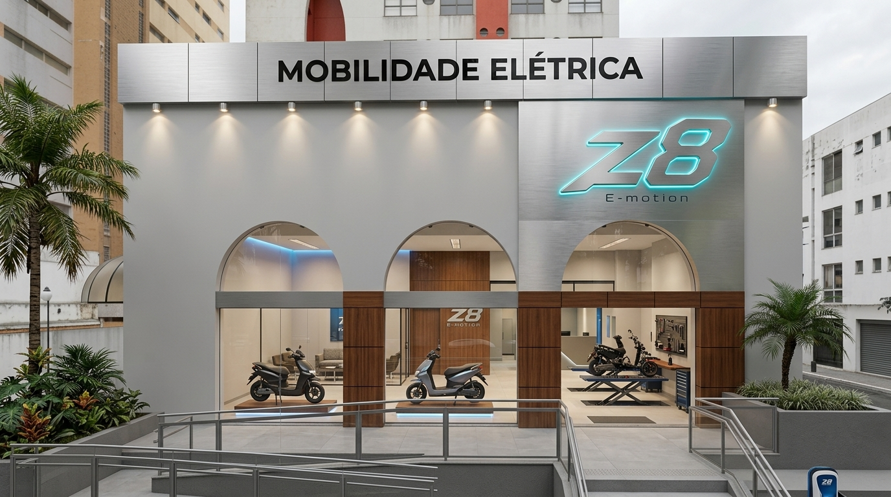
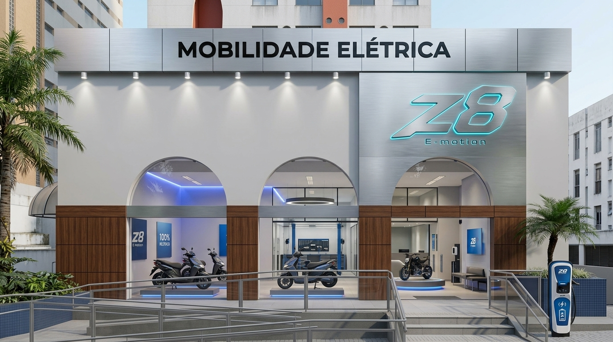

# 🏛️ MANUAL TÉCNICO DE ARQUITETURA, FACHADAS & PLANTAS MODULARES
## **DIRETRIZES CONSTRUTIVAS OFICIAIS DA REDE DE FRANQUIAS Z8 E-MOTION**
*Em conformidade com os Padrões de Grandes Franquias Globais de Mobilidade e Homologação Técnica Nacional*

---

### **1. CONCEITO ARQUITETÔNICO & INSPIRAÇÃO GLOBAL**

A arquitetura das concessionárias **Z8 E-MOTION** inspira-se no que há de mais refinado no varejo de mobilidade e tecnologia mundial (referências no ecossistema de alta tecnologia automotiva como *Tesla Galleries, BMW Motorrad Flagships e Apple Flagships*).

O projeto traduz visualmente:
1. **Sustentabilidade Tecnológica**: Linhas limpas, geometria pura, iluminação cênica eficiente em LED e materiais nobres de alta durabilidade.
2. **Confiança e Engenharia ("Oficina Aquário")**: A assistência técnica não fica escondida nos fundos em ambiente escuro; é integrada visualmente através de divisórias envidraçadas, destacando **2 elevadores técnicos**, limpeza impecável e ferramental de precisão.
3. **Equilíbrio Cromático e Texturas**: O contraste harmônico entre o **Aço Escovado**, a serenidade do cinza **Platina (Ref. Cartela #284)**, o requinte acolhedor da **Madeira Mogno**, a esportividade do logotipo metálico em **Bright Silver** e a energia do **Ciano Elétrico Z8**.

---

### **2. ESPECIFICAÇÕES TÉCNICAS DE MATERIAIS & CORES OFICIAIS**

| Elemento Construtivo | Material Homologado | Especificação Técnica / Acabamento | Referência de Cor / Código |
| :--- | :--- | :--- | :--- |
| **Paredes de Fachada** | Alvenaria com pintura texturizada / ACM | Acabamento acetinado/aveludado liso antimofo resistente a UV e intempéries | **Cinza Platina** (Padrão Cartela #284, HEX `#C2C6CA` / RGB `194, 198, 202`) |
| **Viga Superior / Testeira** | Painel em ACM (Alumínio Composto) | Espessura 4mm, lâmina 0,5mm, núcleo mineral corta-fogo Classe II-A | **Aço Escovado Natural** (Brushed Silver / Inox) com verniz protetor UV |
| **Logotipo Principal Z8** | Letra-caixa 3D em chapa de Aço Inox / Alumínio Naval | Chanfrado aero-esportivo, relevo de 50mm a 70mm, solda a laser, face polida | **Bright Silver Metálico** (Prata Brilhante espelhado) c/ Halo LED 6500K / Ciano |
| **Letreiro Secundário** | Letras usinadas a laser em Acrílico Maciço / ACM | Espessura 10mm a 15mm, corte router de precisão, aplicação sobre viga | **Preto Brilho** (*Black Piano / Black Gloss*, HEX `#000000`, 95 GU de reflexão) |
| **Pórtico / Torre de Entrada** | Painel ACM verticalizado | Espessura 4mm, juntas secas de 4mm com silicone neutro estrutural cinza | **Aço Escovado Natural** contornando o vão de acesso |
| **Detalhes Amadeirados (Opcional)** | Chapa de ACM texturizada amadeirada ou réguas WPC | Acabamento ripado ou painel liso com selamento perimetral | **Madeira Mogno** (*Rich Mahogany*, tom quente acetinado com veios lineares) |
| **Vitrines e Arcos** | Vidro Temperado de Segurança | Espessura 10mm incolor, caixilharia oculta ou alumínio anodizado preto fosco | Transparência total cristalina (sem insulfilm ou películas escurecedoras) |
| **Piso Showroom e Vendas** | Porcelanato Técnico Retificado Acetinado | Formato mínimo 80x80cm ou 90x90cm, absorção d'água ≤ 0,1%, junta de 1,5mm | **Pisos Claros Tom Cinza** (Cinza Platina / Cimento Suave, HEX `#D8DCDE`) |
| **Piso Oficina Técnica** | Resina Epóxi Autonivelante de Alta Resistência | Espessura mínima 3mm, capacidade de carga ≥ 500 kgf/cm², antiderrapante | **Cinza Médio Industrial** (HEX `#8D9399`) c/ faixas de demarcação Ciano/Amarela |
| **Iluminação Cênica Fachada** | Luminárias Downlight de Embutir IP65 | LED COB 15W, temperatura de cor 4000K (Luz Neutra), ângulo de facho 36° | Iluminação rasante sobre os arcos e superfície Platina |

---

### **3. CÁLCULO DA MENOR ÁREA POSSÍVEL PARA UM PONTO COMERCIAL**

#### **3.1. Requisitos Obrigatórios da Rede de Franquias**
- **Lote Mínimo de Motos por Compra**: **10 unidades** (o espaço deve ter capacidade física de abrigar, movimentar e expor o lote sem estrangulamento).
- **Estrutura de Oficina Técnica**: **2 elevadores hidráulicos/pneumáticos para motocicletas** homologados pela matriz.
- **Conformidade Legal**: Sanitário acessível PCD (NBR 9050), circulação técnica desobstruída e estação de recarga rápida de baterias de lítio (Fast Charge 32A).

#### **3.2. Estudo Antropométrico & Dimensões Unitárias**
1. **Veículo Z8 Padrão (Scooter / Motocicleta Elétrica)**:
   - Dimensões médias: `1,90 m` (comprimento) x `0,80 m` (largura com guidão/retrovisores) = `1,52 m²`.
   - **Área em Showroom** (com raio de contemplação e circulação 360° do cliente): `2,50 m x 1,30 m` = **3,25 m² por moto**.
   - **Área em Estoque / Pulmão Técnico** (armazenamento ordenado em 45°/90° com corredor): `2,00 m x 0,90 m` = **1,80 m² por moto**.
   - **Área nos Elevadores da Oficina**: 2 motos já permanecem alocadas diretamente sobre as plataformas dos elevadores.

2. **Baias de Oficina com 2 Elevadores**:
   - Dimensão da plataforma do elevador: `2,20 m x 0,70 m`.
   - Área de trabalho ergonômica por elevador (espaço para o mecânico manusear carrinho de ferramentas e girar o guidão): `3,00 m x 1,60 m` = `4,80 m²`.
   - Bancada de trabalho / painel de ferramentas Z8 / teste de baterias: `2,50 m x 0,60 m` = `1,50 m²`.
   - Corredor de manobra frontal e rampa de subida: `2,50 m x 1,50 m` = `3,75 m²`.
   - **Área Total da Oficina com 2 Elevadores**: **13,50 m² a 15,00 m²**.

3. **Demais Áreas Funcionais Obrigatórias**:
   - Sanitário Acessível PCD (Giro de cadeira de rodas Ø 1,50m): `1,70 m x 1,70 m` = **2,89 m² (arredondado para 3,0 m²)**.
   - Ponto de Atendimento Consultivo / Balcão Caixa: `2,00 m x 1,80 m` = **3,60 m²**.
   - DML (Depósito de Material de Limpeza) e Quadro Elétrico: **1,20 m²**.
   - Corredor de Passagem e Circulação Interna (mínimo 1,00m livre): **7,50 m²**.

#### **3.3. Balanço de Ocupação do Lote Mínimo de 10 Motos no Imóvel**
- **4 Motos no Showroom** (vitrine e podium frontal): `4 x 3,25 m²` = `13,00 m²`.
- **2 Motos na Oficina** (posicionadas nos 2 elevadores técnicos): `0,00 m² adicionais` (integradas na área da oficina).
- **4 Motos no Estoque / Pátio de PDI** (prontas para entrega ou estoque ativo): `4 x 1,80 m²` = `7,20 m²`.
- **Total de Motos no Ponto: 10 motos simultâneas**.

#### **3.4. Resumo da Menor Metragem Viável Absoluta**

```
+-------------------------------------------------------------------------------+
|                 COMPOSIÇÃO DA MENOR ÁREA COMERCIAL HOMOLOGADA                 |
+-------------------------------------------------------------------------------+
|  1. SHOWROOM PRINCIPAL (4 MOTOS EXPOSTAS):   13,00 m²  (26,0%)                |
|  2. OFICINA TÉCNICA (2 ELEVADORES + BANCADA):14,00 m²  (28,0%)                |
|  3. CIRCULAÇÃO LIVRE DE PEDESTRES E MOTOS:    8,00 m²  (16,0%)                |
|  4. ESTOQUE PULMÃO / PDI (4 MOTOS):           7,20 m²  (14,4%)                |
|  5. SANITÁRIO PCD NBR 9050 & DML:             4,20 m²  ( 8,4%)                |
|  6. BALCÃO DE VENDAS & CHECKOUT:              3,60 m²  ( 7,2%)                |
+-------------------------------------------------------------------------------+
|  MENOR ÁREA ÚTIL ABSOLUTA: 50,00 m² | MÍNIMO RECOMENDADO EM PLANTA: 55 a 60 m²|
+-------------------------------------------------------------------------------+
```

> [!IMPORTANT]
> **Conclusão Técnica da Franqueadora**:
> A menor área útil possível para operação plena de uma franquia com **2 elevadores e 10 motos é de 50 m² a 55 m²**.
> O ponto mínimo ideal comercialmente homologado para evitar gargalos de fluxo é de **55 m² a 60 m²**.

---

### **4. ESTRUTURAS DE PLANTAS & VÍNCULOS COM O TAMANHO DAS FACHADAS**

A franqueadora Z8 estabelece 4 formatos de fachada e layout construtivo, calculados para acomodar perfeitamente os 2 elevadores e as 10 motos:

---

#### **4.1. MÓDULO CORREDOR URBAN — FACHADA DE 2,00 METROS**
*Indicado para: Galerias comerciais estreitas, shopping centers strip mall ou imóveis lineares profundos em centros urbanos densos.*

- **Largura da Fachada (Testada)**: `2,00 metros`
- **Profundidade Recomendada**: `28,00 a 30,00 metros`
- **Área Útil Total**: **56,0 m² a 60,0 m²**
- **Arranjo da Fachada**:
  - Testeira superior em ACM Aço Escovado: `2,00 m (largura) x 0,60 m (altura)`.
  - Letreiro "MOBILIDADE ELÉTRICA" em Preto Brilho centralizado: `1,60 m x 0,18 m`.
  - Logotipo Z8 em Bright Silver: `0,80 m x 0,35 m` com iluminação Halo LED.
  - Vão de entrada: Porta pivotante em vidro temperado 10mm de `1,00 m` + vitrine vertical de `1,00 m`.
  - Fundo em pintura Platina #284 e detalhe perimetral do portal em Madeira Mogno.
- **Engenharia de Oficina**: 2 Elevadores instalados em **Linha Contínua (Tandem Longitudinal)** de 2m x 7m.


```
+=============================================================================+
| FACHADA & PLANTA BAIXA: MÓDULO 2,00M CORREDOR URBAN SLIM (ÁREA: 58,0 m²)    |
+=============================================================================+
| [TESTEIRA ACM AÇO ESCOVADO 2,00m x 0,60m]  LETRAS PRETO BRILHO              |
| LOGO Z8 BRIGHT SILVER METÁLICO COM RETROILUMINAÇÃO HALO LED CIANO           |
+------------------------------------+----------------------------------------+
| [VITRINE VIDRO TEMPERADO 1,00m]    | [PORTA ENTRADA VIDRO TEMPERADO 1,00m]  |
+------------------------------------+----------------------------------------+
| 0 a 8m: SHOWROOM LINEAR ESCALONADO (16,0 m²)                                |
| Piso: Porcelanato Retificado Acetinado Claro Cinza Platina 80x80cm          |
|                                                                             |
|   [MOTO 01 - Vitrine Principal] (Podium baixo com moldura LED Ciano)        |
|     \ [MOTO 02 - Urbano N95C] (Disposição em 30° com luz direcional 4000K)  |
|       \ [MOTO 03 - Z8 Tank] (Disposição em 30° voltada p/ fluxo pedestres)  |
|         \ [MOTO 04 - FX-10 Sport] (Disposição 30° c/ ficha técnica digital) |
|   [CORREDOR LIVRE DE CIRCULAÇÃO DE PEDESTRES: 0,90m LARGURA PERMANENTE]     |
+-----------------------------------------------------------------------------+
| 8 a 12,5m: ATENDIMENTO & VENDAS CONSULTIVAS (9,0 m²)                        |
| - Balcão linear slim de atendimento com detalhe ripado em Madeira Mogno     |
| - Terminal PDV / Emissão de NF, Certificados e Chaves Presenciais NFC       |
| - TV corporativa 43" lateral institucional e mostruário capacetes LS2       |
+-----------------------------------------------------------------------------+
| 12,5 a 15m: NÚCLEO SANITÁRIO PCD NBR 9050 & DML (5,0 m²)                    |
| - Sanitário unissex acessível (1,60m x 1,50m) com porta de correr embutida  |
| - DML e Quadro Geral Elétrico QGBT (0,80m x 0,50m)                          |
| - Corredor livre de transição técnica com 0,90m de vão desobstruído         |
+-----------------------------------------------------------------------------+
| 15 a 22,5m: OFICINA TÉCNICA EM LINHA (TANDEM) - 2 ELEVADORES (15,0 m²)      |
| Piso: Epóxi Autonivelante Cinza Médio Industrial (Resistência ≥ 500 kgf/cm²)|
|                                                                             |
|   +--------------------------+                                              |
|   |  ELEVADOR HIDRÁULICO 01  | -> Moto 05 (Em revisão técnica preventiva)   |
|   |  (2,20m x 0,70m)         |                                              |
|   +--------------------------+                                              |
|                | (Espaço intermediário de manobra interna: 1,10m)           |
|   +--------------------------+                                              |
|   |  ELEVADOR HIDRÁULICO 02  | -> Moto 06 (Em processo de revisão de PDI)   |
|   |  (2,20m x 0,70m)         |                                              |
|   +--------------------------+                                              |
| - Bancada estreita suspensa de ferramentas e painel magnético (prof. 40cm)  |
| - Tomada industrial de recarga rápida de bateria Stecker (32A / 220V)       |
+-----------------------------------------------------------------------------+
| 22,5 a 29m: ESTOQUE PULMÃO & PDI FINAL (13,0 m²)                            |
| - Moto 07, Moto 08, Moto 09 e Moto 10 armazenadas em fila para entrega      |
| - Prateleira modular vertical para peças de reposição rápida e cabos        |
| - Portão de serviço para expedição e carga (quando houver acesso fundos)    |
+=============================================================================+
```

---

#### **4.2. MÓDULO COMPACT COMPACTO — FACHADA DE 3,00 METROS**
*Indicado para: Ruas comerciais tradicionais, galerias de centro de bairro e avenidas secundárias.*

- **Largura da Fachada (Testada)**: `3,00 metros`
- **Profundidade Recomendada**: `20,00 a 22,00 metros`
- **Área Útil Total**: **60,0 m² a 66,0 m²**
- **Arranjo da Fachada**:
  - Testeira superior em ACM Aço Escovado: `3,00 m (largura) x 0,70 m (altura)`.
  - Letreiro "MOBILIDADE ELÉTRICA" em Preto Brilho: `2,20 m x 0,22 m`.
  - Logotipo Z8 em Bright Silver: `1,20 m x 0,50 m` com retroiluminação Halo LED Ciano.
  - Vão da vitrine: Vitrine fixa de `1,80 m` em vidro temperado 10mm + Porta de acesso de `1,20 m`.
  - Fundo em textura Cinza Platina #284 com pilar direito em chapa amadeirada Madeira Mogno.
- **Engenharia de Oficina**: 2 Elevadores semi-escalonados com bancada lateral integrada.


```
+=============================================================================+
| FACHADA & PLANTA BAIXA: MÓDULO 3,00M COMPACT STORE DE RUA (ÁREA: 63,0 m²)   |
+=============================================================================+
| TESTEIRA ACM AÇO ESCOVADO 3,00m x 0,70m | LETRAS PRETO BRILHO | LOGO Z8 3D  |
+---------------------------------------------+-------------------------------+
| [VITRINE VIDRO TEMPERADO 1,80m]             | [PORTA VIDRO PIVOTANTE 1,20m] |
| (Base da vitrine com detalhe Madeira Mogno) | (Puxador em Aço Inox)         |
+---------------------------------------------+-------------------------------+
| 0 a 7m: SHOWROOM FRONTAL DE VENDAS (21,0 m²)                                |
| Piso: Porcelanato Retificado Acetinado Claro Cinza Platina 80x80cm          |
|                                                                             |
|   [VITRINE PRINCIPAL: MOTO 01]              [CORREDOR LIVRE ENTRADA 1,20m]  |
|   (Podium elevado com LED Ciano)                                            |
|   [MOTO 02: Z8 FX-10 Sport]                 [MOTO 03: Z8 Tank High-Speed]   |
|   (Ângulo 45° voltado para a rua)           (Ângulo 45° voltado p/ a rua)   |
|   [MOTO 04: Z8 N95C Urbana]                 [TOTEM INTERATIVO DIGITAL]      |
+-----------------------------------------------------------------------------+
| 7 a 11,5m: LOUNGE VIP & ATENDIMENTO CONSULTIVO (13,5 m²)                    |
| - Mesa de atendimento executivo com tampo de vidro e 3 cadeiras giratórias  |
| - Parede de fundo com painel em Madeira Mogno, logo Z8 iluminado e TV 50"   |
| - Expositor de capacetes homologados (LS2, Pro Tork, Taurus) e cafeteria    |
+-----------------------------------------------------------------------------+
| 11,5 a 13,5m: SANITÁRIO PCD NBR 9050 & DML TÉCNICO (6,0 m²)                 |
| - Sanitário unissex acessível (1,70m x 1,60m) NBR 9050                      |
| - Depósito Técnico DML e armário para recarregadores (1,30m x 1,00m)        |
| - Corredor central de circulação técnica livre (largura permanente 1,20m)   |
+-----------------------------------------------------------------------------+
| 13,5 a 18m: OFICINA TÉCNICA CERTIFICADA - 2 ELEVADORES (13,5 m²)            |
| Piso: Epóxi Autonivelante Cinza Médio 3mm (Resistência ≥ 500 kgf/cm²)       |
|                                                                             |
|   +--------------------------+          +--------------------------+        |
|   |  ELEVADOR HIDRÁULICO 01  |          |  ELEVADOR HIDRÁULICO 02  |        |
|   |  (Moto 05 em manutenção) |          |  (Moto 06 em manutenção) |        |
|   +--------------------------+          +--------------------------+        |
|   \_________ Corredor entre elevadores com passagem livre de 0,80m ________/|
| - Bancada industrial Z8 de ferramentas e painel magnético de parede         |
| - Estação certificada de teste e recarga de baterias com extintor CO2       |
+-----------------------------------------------------------------------------+
| 18 a 21m: ESTOQUE TÉCNICO & BOX DE PDI (9,0 m²)                             |
| - Moto 07, Moto 08, Moto 09 e Moto 10 prontas para expedição e entrega      |
| - Prateleira aérea vertical para componentes de reposição rápida e cabos    |
+=============================================================================+
```

---

#### **4.3. MÓDULO STANDARD STORE — FACHADA DE 5,00 METROS**
*Indicado para: Concessionárias padrão de grandes avenidas comerciais, esquinas e centros automotivos.*

- **Largura da Fachada (Testada)**: `5,00 metros`
- **Profundidade Recomendada**: `16,00 a 18,00 metros`
- **Área Útil Total**: **80,0 m² a 90,0 m²**
- **Arranjo da Fachada**:
  - Testeira superior contínua em ACM Aço Escovado: `5,00 m (largura) x 0,80 m (altura)`.
  - Letreiro "MOBILIDADE ELÉTRICA" em Preto Brilho de alto relevo: `3,40 m x 0,30 m`.
  - Torre/Pórtico lateral com Logo Z8 3D Bright Silver: `1,60 m x 0,70 m` com halo LED ciano.
  - Fundo geral das paredes em tom Platina #284 acetinado com 4 arandelas/downlights 4000K.
  - 2 Grandes vitrines panorâmicas envidraçadas (ou pórticos em arco) de `1,80 m` cada + porta de vidro central de `1,40 m`.
  - Base dos pilares revestida em chapa amadeirada Madeira Mogno.
- **Engenharia de Oficina**: 2 Elevadores instalados **Lado a Lado (Twin Bay)** com divisória em vidro temperado (*Conceito Oficina Aquário*).



```
+=============================================================================+
| FACHADA & PLANTA BAIXA: MÓDULO 5,00M CONCESSIONÁRIA STANDARD (85,0 m²)      |
+=============================================================================+
| TESTEIRA ACM AÇO ESCOVADO 5,00m x 0,80m | LETREIRO PRETO BRILHO | LOGO Z8   |
| * Downlight 1        * Downlight 2        * Downlight 3        * Downlight 4|
+------------------------+----------------------------+-----------------------+
| [VITRINE ARCO 01 1,80m]| [PORTA CENTRAL VIDRO 1,40m]| [VITRINE ARCO 02 1,80m|
| (Base Madeira Mogno)   | (Puxadores Inox / NBR 9050)| (Base Madeira Mogno)  |
+------------------------+----------------------------+-----------------------+
| 0 a 7m: SHOWROOM PRINCIPAL DE VEÍCULOS (35,0 m²)                            |
| Piso: Porcelanato Retificado Acetinado Claro Cinza Platina 90x90cm          |
|                                                                             |
|   [VITRINE ESQUERDA: MOTO 01]                 [VITRINE DIREITA: MOTO 02]    |
|   (Scooter Urbana N95C)                       (Scooter Retrô Vintage)       |
|                                                                             |
|                  +--------------------------------------+                   |
|                  | PODIUM CENTRAL ELEVADO COM LED CIANO |                   |
|                  | MOTO 03: Z8 TANK HIGH-SPEED (80 km/h)|                   |
|                  +--------------------------------------+                   |
|                                                                             |
|   [MOTO 04: Z8 FX-10 Sport]                   [MOTO 05: Z8 U2 Cargo Delivery|
+-----------------------------------------------------------------------------+
| 7 a 11m: LOUNGE VIP, BOUTIQUE & VENDAS CONSULTIVAS (20,0 m²)                |
| [LADO ESQUERDO: VENDAS]               | [LADO DIREITO: LOUNGE & BOUTIQUE]   |
| - 2 Mesas para consultores de venda   | - Sofá modular grafite e mesa centro|
| - Simulador de crédito, parcelas e NF | - Painel Madeira Mogno com TV 55"   |
| - Central entrega de chaves e NFC     | - Expositor de capacetes homologados|
+---------------------------------------+-------------------------------------+
| 11 a 12,5m: SANITÁRIO PCD & DML TÉCNICO (7,5 m²)                            |
| - Sanitário unissex NBR 9050 + corredor envidraçado de 1,40m livre          |
+-----------------------------------------------------------------------------+
|================= DIVISÓRIA DE VIDRO ("OFICINA AQUÁRIO") ====================|
| 12,5 a 17m: OFICINA COM 2 ELEVADORES (14,4 m²)| ESTOQUE & PDI (8,1 m²)      |
| Piso: Epóxi Autonivelante Cinza Médio 3mm     | - Moto 09 e Moto 10         |
|  +-------------------+  +-------------------+ | - Prateleiras porta-peças   |
|  | ELEVADOR TWIN 01  |  | ELEVADOR TWIN 02  | | - Baterias e carregadores   |
|  | (Moto 07 revisão) |  | (Moto 08 revisão) | | - Tomada Fast Charge 32A    |
|  +-------------------+  +-------------------+ |                             |
| - Bancada industrial com ferramentas Z8       |                             |
+=============================================================================+
```

---

#### **4.4. MÓDULO MASTER FLAGSHIP — FACHADA DE 10,00 A 14,90 METROS**
*Inspiração direta e correspondência 1:1 com o Render Oficial 3D e Projeto Executivo de Fachada.*

- **Largura da Fachada (Testada)**: `10,00 a 14,90 metros` (conforme cotas oficiais: `14,90 m x 1,00 m` de viga superior).
- **Profundidade Recomendada**: `15,00 a 18,00 metros`
- **Área Útil Total**: **150,0 m² a 250,0 m²**
- **Arranjo da Fachada**:
  - Testeira contínua em ACM Aço Escovado: `14,90 m (largura) x 1,00 m (altura)`.
  - Letreiro "MOBILIDADE ELÉTRICA" em Preto Brilho de alta visibilidade: `6,78 m x 0,55 m` com 7 spots embutidos tipo downlight IP65 de 4000K na face inferior da viga.
  - Torre Monumental de Entrada: `4,20 m (altura) x 1,80 m (largura)` totalmente revestida em ACM Aço Escovado.
  - Logotipo Z8 em alto-relevo metálico Bright Silver com acabamento chanfrado e retroiluminação Halo LED branca e ciano, com inscrição "E-motion" inferior.
  - Fachada frontal com **3 Grandes Arcos Monumentais** em alvenaria revestida no tom **Cinza Platina #284**.
  - Bases dos pilares dos arcos revestidas em chapa padrão **Madeira Mogno** de alta durabilidade.
  - Vidros temperados 10mm cristalinos com visibilidade total do showroom a partir da rua.
  - Totem externo para carregador público/cliente Z8 (EV Charging Station).



```
+=============================================================================+
| FACHADA & PLANTA EXECUTIVA: MASTER FLAGSHIP (14,90m x 16,00m = 238,4 m²)    |
+=============================================================================+
| [TESTEIRA ACM AÇO ESCOVADO 14,90m x 1,00m]  "MOBILIDADE ELÉTRICA" (6,78m)   |
|  * Spot 1  * Spot 2  * Spot 3  * Spot 4  * Spot 5  * Spot 6  * Spot 7       |
+---------------------------------------------+-------------------------------+
| PAREDE FRONTAL CINZA PLATINA (#284)         | [TORRE ENTRADA ACM 4,20x1,80m]|
|                                             |                               |
|   /""""""\       /""""""\       /""""""\    |          /""""""\             |
|  / ARCO 01\     / ARCO 02\     / ARCO 03\   |         / PORTAL \  [LOGO Z8  |
| |  VITRINE |   |  VITRINE |   |  VITRINE |  |        | ENTRADA  |  METÁLICO |
| | (Motos)  |   | (Motos)  |   | (Motos)  |  |        | (Vidro)  |  BRIGHT   |
| [BASE MOG] |   [BASE MOG] |   [BASE MOG] |  |        [BASE MOG] |  SILVER]  |
+---------------------------------------------+-------------------------------+
| ZONA 1: SHOWROOM FLAGSHIP & PODIUMS DE LANÇAMENTO (134,1 m²)                |
| Piso: Porcelanato Retificado Acetinado Claro Cinza Platina 90x90cm          |
|                                                                             |
|  [ARCO 01: FX-10]    [ARCO 02: N95C]    [ARCO 03: U2 Cargo]  [PORTAL AUTO]  |
|                                                                             |
|               +---------------------------------------------+               |
|               | PODIUM CENTRAL DE DESTAQUE: Z8 TANK (80km/h)|               |
|               | ILUMINAÇÃO PERIMETRAL EM FITA LED CIANO Z8  |               |
|               +---------------------------------------------+               |
|                                                                             |
| - Exposição fluida de 8 a 10 modelos Z8 simultâneos com circulação 360°     |
| - 2 Totens digitais interativos touchscreen com catálogo e simulador        |
+-----------------------------------------------------------------------------+
| ZONA 2: LOUNGE VIP & CAFÉ (20 m²)     | ZONA 3: MESA VENDAS & B2B (24 m²)   |
| - Sofás em couro grafite escuro       | - 3 Estações para consultores       |
| - Painel Madeira Mogno com TV 55"     | - Mesa executiva fechamento frotas  |
| - Mostruário capacetes e jaquetas     | - Checkout, contratos e chaves NFC  |
+---------------------------------------+-------------------------------------+
| ZONA 4: APOIO SANITÁRIO PCD (15 m²)   | ZONA 5: FAST CHARGE Z8 (10 m²)      |
| - Sanitários Masc. e Fem. NBR 9050    | - 2 Carregadores rápidos 32A/380V   |
| - DML e Sala de TI / NVR de câmeras   | - Painel de baterias LiFePO4        |
+---------------------------------------+-------------------------------------+
|========= DIVISÓRIA PANORÂMICA EM VIDRO DUPLO ("OFICINA SHOW") ==============|
|                                                                             |
| ZONA 6: CENTRO TÉCNICO MASTER (36 m²) | ZONA 7: ESTOQUE VERTICAL (35 m²)    |
| Piso: Epóxi Cinza Médio ≥ 500 kgf/cm² | - Armazenamento de 10 a 20 motos    |
|                                       | - Estrutura porta-paletes industrial|
|  +----------------+  +----------------+ - Doca de carga e descarga          |
|  | ELEVADOR 01    |  | ELEVADOR 02    | - Bancada de testes elétricos       |
|  | (Cap. 500 kg)  |  | (Cap. 500 kg)  |                                     |
|  +----------------+  +----------------+                                     |
| - Painel de ferramentas padronizado Z8                                      |
+=============================================================================+
```

---

### **5. QUADRO COMPARATIVO CONSOLIDADO: FACHADAS X METRAGEM X CAPACIDADE**

| Parâmetro | Módulo 2 Metros (Corredor Urban) | Módulo 3 Metros (Compact Rua) | Módulo 5 Metros (Standard Store) | Módulo 10 Metros (Master Flagship) |
| :--- | :---: | :---: | :---: | :---: |
| **Largura da Fachada (Testada)** | `2,00 m` | `3,00 m` | `5,00 m` | `10,00 a 14,90 m` |
| **Profundidade Média do Imóvel** | `28,00 a 30,00 m` | `20,00 a 22,00 m` | `16,00 a 18,00 m` | `15,00 a 18,00 m` |
| **Área Útil Construída (m²)** | **56 a 60 m²** *(Menor área possível)* | **60 a 66 m²** | **80 a 90 m²** | **150 a 250 m²** |
| **Elevadores de Oficina Oferecidos** | **2 Elevadores** *(Em linha / Tandem)* | **2 Elevadores** *(Semi-escalonados)* | **2 Elevadores** *(Lado a lado / Twin)* | **2 Elevadores** *(Oficina Showroom)* |
| **Motos Expostas no Showroom** | 3 a 4 motos | 4 a 5 motos | 5 a 6 motos | 8 a 10 motos |
| **Motos em Estoque / PDI / Elevadores** | 6 a 7 motos | 5 a 6 motos | 5 a 6 motos | 10 a 15 motos |
| **Capacidade Total de Motos no Ponto** | **10 motos** *(Lote Mínimo Atendido)*| **10 a 11 motos** | **10 a 12 motos** | **18 a 25 motos** |
| **Piso de Showroom** | Porcelanato Claro Platina 80x80 | Porcelanato Claro Platina 80x80 | Porcelanato Claro Platina 90x90 | Porcelanato Claro Platina 90x90/120x60 |
| **Piso da Oficina** | Epóxi Cinza Médio 3mm | Epóxi Cinza Médio 3mm | Epóxi Cinza Médio 3mm | Epóxi Cinza Médio 3mm |
| **Revestimento da Testeira** | ACM Aço Escovado | ACM Aço Escovado | ACM Aço Escovado | ACM Aço Escovado 14,90m x 1,00m |
| **Acabamento do Letreiro** | Preto Brilho (Black Piano) | Preto Brilho (Black Piano) | Preto Brilho (Black Piano) | Preto Brilho (6,78m x 0,55m) |
| **Logotipo Z8 na Fachada** | Bright Silver Metálico Halo LED | Bright Silver Metálico Halo LED | Bright Silver Metálico Halo LED | Bright Silver Metálico Halo LED |
| **Detalhe Madeira Mogno** | Opcional (moldura portal) | Opcional (pilar lateral) | Opcional (bases dos arcos) | Opcional (bases dos 3 arcos) |

---

### **6. DIRETRIZES DE APROVAÇÃO DO PROJETO ARQUITETÔNICO**

Conforme estipulado no Contrato Padrão de Franquia e na Circular de Oferta de Franquia (COF):
1. **Etapa 1 - Estudo de Viabilidade do Ponto**: O franqueado envia as medidas do imóvel, fotos da testada e localização para aprovação preliminar da Franqueadora Z8.
2. **Etapa 2 - Projeto Executivo e Layout Cad/3D**: O departamento de arquitetura da Z8 valida ou emite a planta baixa modulada baseada na largura da testada (2m, 3m, 5m ou 10m).
3. **Etapa 3 - Homologação de Materiais**: É vedada a alteração da paleta (Cinza Platina #284, Aço Escovado, Bright Silver, Madeira Mogno e Preto Brilho), garantindo a integridade e o valor de marca em todo o território nacional.
