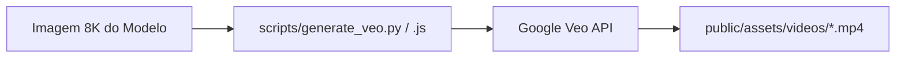

# 🎬 Guia de Automação de Vídeos Google Veo (Z8 E-Motion)

Este módulo automatiza a geração de vídeos cinematográficos automotivos em alta resolução (1080p/4K, 60fps) usando a **API do Google Veo** (Google DeepMind) integrada ao ecossistema Z8.

---

## ⚡ 1. Como Funciona

O script conecta à API do Google, carrega a imagem de alta resolução do modelo (ex: Z8 Tank na Paulista ou FX-10 em SJC), envia as instruções de movimento de câmera cinematográfica (Image-to-Video) e faz o download automático do arquivo `.mp4` para [`public/assets/videos/`](../public/assets/videos/).



---

## 🔑 2. Configuração Rápida (1 Minuto)

1. Obtenha sua chave gratuita de API no [Google AI Studio](https://aistudio.google.com/).
2. Crie ou edite o arquivo `.env` na raiz do projeto:
```env
GEMINI_API_KEY=sua_chave_aqui
```

---

## 🚀 3. Como Executar

Você pode rodar tanto via **NPM** quanto via **Python**:

### Usando NPM / Node.js:
```bash
# Z8 Tank na Av. Paulista
npm run veo:tank

# Z8 FX-10 Sport em São José dos Campos
npm run veo:fx10

# Listar todos os presets disponíveis
npm run veo:list
```

### Usando Python:
```bash
# Z8 Tank na Av. Paulista (Plano Aberto)
python scripts/generate_veo.py --preset tank-paulista

# Z8 Tank Close do Farol Halo LED
python scripts/generate_veo.py --preset tank-headlight

# Z8 FX-10 em São José dos Campos
python scripts/generate_veo.py --preset fx10-sjc

# Z8 FX-10 em Campos do Jordão (Capivari)
python scripts/generate_veo.py --preset fx10-capivari

# Menu Interativo (escolha visual)
python scripts/generate_veo.py
```

---

## 🎨 4. Customização Avançada

Você também pode gerar vídeos personalizados passando sua própria imagem e descrição de cena:

```bash
# Formato Vertical (Reels / TikTok 9:16)
python scripts/generate_veo.py --image public/assets/models/z8_tank_paulista_wide.jpg --prompt "Dynamic drone tracking shot rising over the motorcycle, 9:16 vertical reels" --aspect 9:16 --output z8_reels.mp4

# Cena Personalizada
python scripts/generate_veo.py --prompt "Z8 FX-10 Sport accelerating smoothly on a futuristic neon highway" --output z8_future.mp4
```

---

## 📂 5. Destino dos Arquivos
Todos os vídeos renderizados são salvos automaticamente em:
[`public/assets/videos/`](../public/assets/videos/)
E ficam imediatamente disponíveis para incorporação em tags `<video>` do Hero e nas páginas de produto da Z8 E-Motion.
