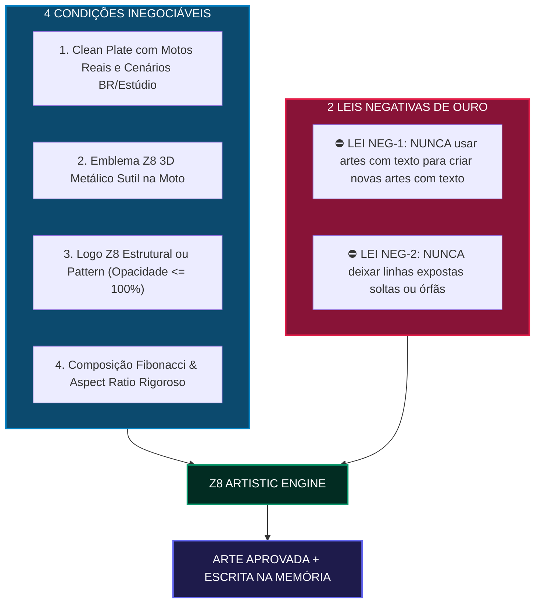
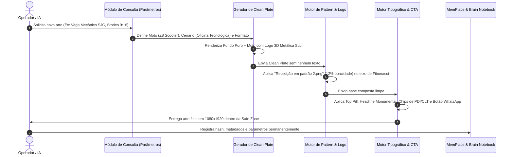

# ⚡ Z8 Visual Engine: Motor Artístico, Consultivo e Rede de Memória

> **Documento Oficial de Engenharia Visual, Filosofia Estética e Cadeia de Construção para Redes Sociais, Campanhas B2B/B2C e Brand Assets da Z8 E-Motion®.**  
> *Indexado perpetuamente no MemPlace e no Brain Notebook do Projeto.*

---

## 1. Manifesto Artístico: A Convergência de Grandes Escolas

O **Z8 Visual Engine** nasce da fusão entre a engenharia de ponta da mobilidade elétrica e os maiores movimentos da história do design gráfico mundial, calibrado pela visão técnica e humanizada dos grandes mestres do design contemporâneo.

```
       [ BAUHAUS (1919) ]                  [ CONSTRUTIVISMO RUSSO (1920) ]
  "A forma segue a função estrita"             "Dinamismo diagonal e tensão monumental"
             │                                              │
             └───────────────────────┬──────────────────────┘
                                     │
                     [ ESTILO TIPOGRÁFICO SUÍÇO (1950) ]
                     "A disciplina libertadora da grelha matemática"
                                     │
                     [ WALTER MATTOS & DESIGN MINIMALISTA ]
                     "Fibonacci prático, ajuste óptico e rigor vetorial"
                                     │
                                     ▼
                   ┌───────────────────────────────────┐
                   │    Z8 VISUAL ENGINE & MEMORY      │
                   │  Pureza, Eletricidade e Impacto   │
                   └───────────────────────────────────┘
```

### 1.1. Bauhaus (Dessau/Weimar - Gropius, Herbert Bayer, Moholy-Nagy)
* **Forma segue a Função (*Form folgt Funktion*)**: Nenhum ornamento existe por acaso. Cada pixel, badge ou espaço em branco tem propósito de comunicação ou usabilidade.
* **Assimetria Dinâmica**: O equilíbrio não é estático/centralizado ingênuo; é um contrapeso de massas (um bloco monumental compensado por um respiro negativo amplo).
* **Tipografia como Arquitetura**: Uso exclusivo de fontes grotescas geométricas sem serifa, limpas e de leitura instantânea.

### 1.2. Construtivismo Russo & Vanguardas (Rodchenko, El Lissitzky, Stepanova)
* **Escala Monumental & Tensão Visual**: Títulos com pesos titânicos (*Ultra-Bold / Black*) colocados em diálogo direto com dados de telemetria microscópicos de altíssima precisão.
* **Ruptura Diagonal Controlada**: Uso de padrões repetidos em eixos isométricos de 30° e 45° para evocar aceleração, velocidade instantânea do motor elétrico e vanguarda industrial.

### 1.3. Estilo Tipográfico Internacional / Escola Suíça (Josef Müller-Brockmann)
* **O Sistema de Grelhas (Grid Systems)**: A matemática organiza o caos visual. Todos os elementos obedecem a colunas, linhas de base (*baseline grid*) e intervalos modulares rigorosos.

### 1.4. Walter Mattos & A Humanização Nativa do Design Brasileiro
* **Desmistificação Consciente de Fibonacci**: A Proporção Áurea ($\phi \approx 1,618$) e a Espiral de Fibonacci são tratadas como **ferramentas de balanço composicional e proporção relativa**, nunca como misticismo ou dogma cego.
* **Compensação Óptica > Alinhamento Mecânico**: O olho humano é o juiz final. Elementos pontiagudos (como o 'Z' da marca) ou pesos tipográficos assimétricos exigem compensação visual além da régua matemática pura.
* **Higiene Vetorial Impecável**: Proibição de nós soltos, curvas de Bézier truncadas, contornos pixelados ou sobreposições sujas.

### 1.5. Benchmarks Automotivos de Elite no Behance
* Referência visual direta das identidades mais premiadas do mundo em mobilidade elétrica: **Polestar**, **Cake Bikes**, **Arc Vehicle**, **Verge Motorcycles** e **Porsche Design Studio**.
* Tratamento fotográfico com profundidade de campo cinematográfica (*Cinematic Depth of Field*), iluminação de estúdio *rim light* (luz de borda cortando a silhueta da moto) e fundos limpos que conferem valor de joia tecnológica.

---

## 2. As 4 Condições Inegociáveis & 2 Leis Negativas de Criação

Toda e qualquer arte gerada por IA, script ou designer para a Z8 E-Motion deve passar obrigatoriamente pelo seguinte checklist de condições:



### 1ª Condição: Clean Plate de Fundo (Motos Reais e Cenários Brasileiros ou Estúdio)
* A arte de fundo deve ser **100% limpa de textos**, construída em alta resolução.
* A moto deve ser **exclusivamente um dos 11 modelos reais do catálogo oficial Z8** (`z8Models` em `site-principal/data/models.js`).
* **Cenários Permitidos**:
  1. *Território Brasileiro Real*: Serra Gaúcha (RS), Vale do Paraíba (SP), Brasília Monumental (DF), Orla de Santos/Rio, Corredores Tecnológicos do Agro (Centro-Oeste).
  2. *Estúdio Fotográfico Flagship*: Fundo infinito Cinza Platina (#C2C6CA), piso reflexivo escuro, iluminação dramática de estúdio automotivo.

### 2ª Condição: Logotipo Z8 em Alto-Relevo Metálico na Moto
* Toda motocicleta representada deve possuir o emblema Z8 como um **emblema metálico 3D em alto-relevo sutil** (Bright Silver / Cromo Polido com chanfro aeroesportivo), inserido de forma orgânica nas laterais do tanque ou na carenagem frontal.
* O tamanho deve ser sofisticado e sutil (estilo Porsche/Ducati), sem poluir as linhas aerodinâmicas do veículo.

### 3ª Condição: Integração Estrutural da Logo Z8 (Minimalista ou Pattern)
* Toda peça deve conter a marca Z8 incorporada à sua arquitetura visual:
  * Como selo minimalista arquitetônico (`logo minimalista.png` ou `z8logo.png`), OU
  * Como detalhe de repetição geométrica em padrão isométrico diagonal (`Repetição em padrão.png` ou `Repetição em padrão 2.png`).
* **Opacidade**: Rigorosamente calibrada entre **5% e 25%** para texturas de fundo / marca d'água estrutural, e até **100%** para selos principais e acentos de velocidade.

### 4ª Condição: Composição Impecável em Aspect Ratio e Fibonacci
* A diagramação de massas visuais deve respeitar a **Proporção Áurea ($\phi \approx 1,618$)**:
  * Ponto focal do produto no cruzamento da Espiral de Fibonacci.
  * Divisão horizontal dourada: $Y \approx 0,618 \times \text{altura total}$ para ancoragem do solo/veículo.
* Formatos obrigatórios:
  * **Stories / Reels**: `9:16` (1080 × 1920 px) com Safe Zone entre $Y = 260px$ e $Y = 1600px$.
  * **Feed Retrato**: `4:5` (1080 × 1350 px).
  * **Feed Quadrado**: `1:1` (1080 × 1080 px).

---

### ⛔ As 2 Leis Negativas de Ouro

> [!CAUTION]
> **LEI NEGATIVA 1 (PROIBIÇÃO DE CONTAMINAÇÃO TEXTUAL)**:  
> **NUNCA** utilize artes que já possuam textos rasterizados pré-existentes como base/referência/prompt de IA para gerar novas imagens. As IAs tentam interpretar letras como geometria, gerando tipografias deformadas e aberrações visuais.  
> **O processo canônico é**: Primeiro gera-se o **Clean Plate** (imagem pura de alta definição), e depois as camadas tipográficas vetoriais são aplicadas por cima via Canvas/SVG/Figma.

> [!CAUTION]
> **LEI NEGATIVA 2 (PROIBIÇÃO DE LINHAS EXPOSTAS ÓRFÃS)**:  
> **NUNCA** deixe linhas expostas soltas (traços horizontais de Word, sublinhados default ou contornos sem ancoragem). Elementos de separação devem ser tratados como **containers modulares**, **cards translúcidos com borda de 1px** ou **pílulas de categoria**. Se uma linha for estritamente necessária, deve fazer parte de um bloco unificado ou escala técnica de telemetria.

---

## 3. Catálogo Técnico da Rede de Assets (`public/assets/logos/`)

A pasta `public/assets/logos/` centraliza a biblioteca vetorial e raster de alta fidelidade:

| Arquivo | Descrição Visual | Formato & Resolução | Blending Mode & Opacidade | Uso Canônico |
| :--- | :--- | :--- | :--- | :--- |
| **`logo minimalista.png`** | Emblema 3D em chapa de Bright Silver/Cromo com chanfro biselado e relevo realista | PNG Alpha (3D Render) | `Normal` / `Overlay`<br>Opacidade: 80% a 100% | Selo oficial nas carenagens das motos, fechamento de rodapé e cartões de visita. |
| **`Repetição em padrão.png`** | Grade isométrica diagonal monocromática branca de repetição contínua do logo Z8 | PNG Alpha (Isométrico) | `Screen` / `Soft Light`<br>Opacidade: 5% a 20% | Textura de fundo de luxo, marcas d'água arquitetônicas e áreas de respiro negativo. |
| **`Repetição em padrão 2.png`** | Grade isométrica diagonal em Ciano Elétrico Z8 (`#00F0FF`) vibrante | PNG Alpha (Isométrico) | `Screen` / `Color Dodge`<br>Opacidade: 15% a 40% | Faixas de alta velocidade, acentos de arrancada, posts de performance (Tank / FX-10). |
| **`Logo com impacto.png`** | Logotipo dual-tone de alta energia (Z Verde Neon + 8 Ciano + "E-MOTION POWER") | PNG Alpha | `Normal`<br>Opacidade: 100% | Campanhas jovens, lançamentos de verão, posts de sustentabilidade e baterias. |
| **`Mecanicos.png`** | Selo tipográfico arquitetural vertical ("Z8 E-MOTION // ELECTRIC MOBILITY") | PNG Alpha Vertical | `Normal`<br>Opacidade: 70% a 90% | Lateral técnica em cartazes verticais (Stories/Mupis), áreas de oficina e pós-venda. |
| **`z8logo.png` / `logo_z8_main.png`** | Logotipo horizontal oficial Z8 em vetor plano branco/metálico | PNG Alpha Master | `Normal`<br>Opacidade: 100% | Cabeçalho institucional, testeiras de concessionária e faturas. |
| **`ztrasparente.png`** | O ícone "Z" em recorte translúcido de grandes dimensões | PNG Alpha Gigante | `Overlay` / `Luminosity`<br>Opacidade: 8% a 15% | Elemento gráfico de fundo (*Watermark Hero*), criando profundidade atrás da moto. |

---

## 4. A Matemática de Composição: Fibonacci, Aspect Ratio e Walter Mattos

### 4.1. A Escala Modular de Tipografia (Razão Áurea $\phi$)
Para que os textos conversem em harmonia perfeita sem tamanhos aleatórios, os corpos de texto seguem a progressão geométrica de Fibonacci:

$$\text{Tamanho}_{n} = \text{Tamanho}_{n-1} \times 1,618$$

* **Nível 1 (Legenda / Telemetria)**: $16\text{ px}$ (Chakra Petch Semi-Bold)
* **Nível 2 (Pílulas / Sub-dados)**: $26\text{ px}$ (Chakra Petch Bold)
* **Nível 3 (Sub-headlines)**: $42\text{ px}$ (Outfit Semi-Bold)
* **Nível 4 (Headlines de Impacto)**: $68\text{ px}$ (Outfit Extra-Bold)
* **Nível 5 (Monumento Principal em Stories)**: $110\text{ px}$ (Outfit Black Grotesque)

### 4.2. A Grelha de Zonas em Stories (9:16 - 1080 × 1920 px)

```
0px -------------------------------------------------------------
    [ ZONA MORTA SUPERIOR - 260px ]
    Reservada para interface do Instagram (Perfil, Tempo, Botão Fechar)
260px ----------------------------------------------------------- <- INÍCIO SAFE ZONE
    [ BLOCO 1: TOP STATUS PILL (Fibonacci Y = 280px) ]
    ⚡ Z8 E-MOTION // CONCESSÃO 2026

    [ BLOCO 2: HEADLINE MONUMENTAL (Y = 360px a 520px) ]
    EXPANSÃO NACIONAL DE CONCESSIONÁRIAS

    [ BLOCO 3: ZONA DO VEÍCULO HERÓI (Y = 560px a 1220px) ]
    - Repouso da moto na Proporção Áurea inferior (Y = 1186px = 1920 x 0.618)
    - Emblema Z8 metálico em alto-relevo sutil na carenagem
    - Textura de "Repetição em padrão.png" com 10% de opacidade no quadrante superior direito

    [ BLOCO 4: MICRO-TELEMETRIA & REQUISITOS (Y = 1260px a 1420px) ]
    Chips modulares translúcidos: [🔧 2 Elevadores] [📈 Margem 52%] [📜 CONTRAN 996]

    [ BLOCO 5: CALL TO ACTION UNIFICADO (Y = 1450px a 1580px) ]
    Botão tátil sólido com canal explícito de conversão (WhatsApp / Direct)
1600px ---------------------------------------------------------- <- FIM SAFE ZONE
    [ ZONA MORTA INFERIOR - 320px ]
    Reservada para campo "Enviar Mensagem", curtidas e compartilhamento
1920px ----------------------------------------------------------
```

---

## 5. Pipeline de Construção em 5 Fases do Motor Artístico



---

## 6. Ferramentas Open-Source & Integrações GitHub Mapeadas

Para potencializar e automatizar a criação artística gratuita no projeto:

1. **HTML5 Canvas Engine (Nativo do Z8)**:
   - Implementado em `posters/app.js`, renderiza vinhetas cinemáticas, grids matemáticos, badges de alta resolução e gera downloads PNG com um clique.
2. **Penpot (Open-Source Figma Alternative)**:
   - Ferramenta web open-source baseada nativamente em SVG e padrões web para desenho vetorial, criação de componentes e exportação de tokens CSS.
3. **Inkscape Engine**:
   - Padrão open-source para manipulação de curvas de Bézier e alinhamento geométrico de alta precisão milimétrica.
4. **Algoritmos Generativos em P5.js & D3.js**:
   - Scripts para geração matemática da Espiral de Fibonacci, matrizes de pontos de alta densidade e padrões isométricos dinâmicos com semente reprodutível (*seedrandom*).
5. **Automação via Node.js & Sharp / Canvas**:
   - Criação de scripts no backend para compor automaticamente imagens de motos, aplicar o padrão de repetição com blending modes e exportar em lote para campanhas de todas as 5 regiões do Brasil.

---

## 7. Inscrição e Indexação Perpétua de Memória

Toda vez que uma nova arte for desenvolvida pelo Z8 Visual Engine, o seguinte registro padrão deve ser adicionado à memória do projeto:

```markdown
### Registro de Arte: [ID_DA_ARTE]
- Data: [DATA]
- Objetivo: [Recrutamento | Franquia | Lançamento | Pós-Venda]
- Modelo Hero: [Modelo Z8]
- Cenário: [Região BR ou Estúdio]
- Formato: [9:16 Stories | 4:5 Feed | 1:1 Feed]
- Asset Estrutural Aplicado: [Ex: Repetição em padrão 2.png @ 12%]
- Logo na Moto: 3D Metálico Bright Silver sutil presente (Sim/Não)
- CTA: [Canal e Chamada Utilizada]
- Status de Conformidade: 100% em compliance com Safe Zones e Leis Negativas.
```
