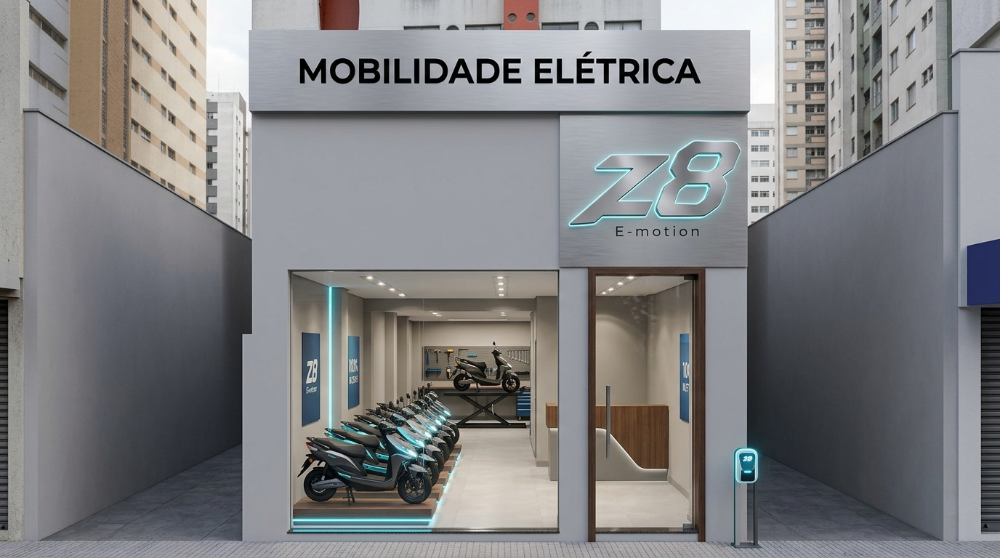
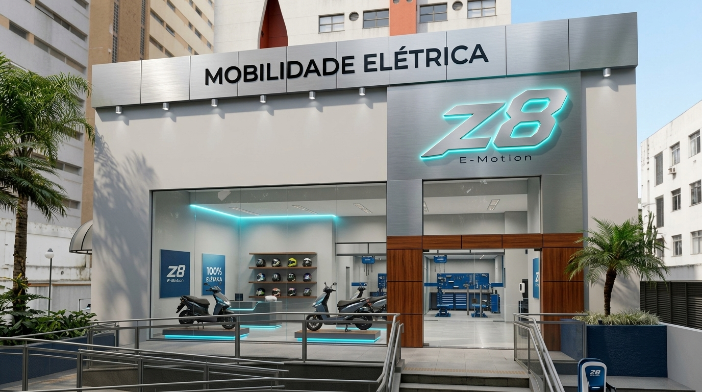

# 🏛️ GUIA EXECUTIVO DE PADRONIZAÇÃO DE FACHADAS & ARQUITETURA MODULAR
## **REDE NACIONAL DE CONCESSIONÁRIAS & FRANQUIAS Z8 E-MOTION**
*Caderno de Encargos Arquitetônicos, Engenharia de Varejo e Plantas Baixas Homologadas*

---

## 1. INTRODUÇÃO & BENCHMARKING DE GRANDES FRANQUIAS

A concepção arquitetônica da rede **Z8 E-MOTION** segue as melhores práticas mundiais adotadas por redes líderes em mobilidade, tecnologia e varejo automotivo de alto padrão (*BMW Motorrad, Tesla Store, Harley-Davidson Retail e Apple Stores*).

Os três pilares fundamentais do padrão arquitetônico Z8 são:
1. **Modularidade e Escalabilidade**: Capacidade de implantação em diferentes perfis imobiliários urbanos, desde corredores compactos de shopping e centros comerciais (testadas a partir de 2,00m) até concessionárias *Flagship* em grandes avenidas (testadas de 10,00m a 15,00m).
2. **Engenharia e Transparência ("Oficina Aquário")**: A área técnica não é segregada em um espaço escuro aos fundos. Ela é exposta através de painéis envidraçados translúcidos, posicionando os **2 elevadores hidráulicos** e o ferramental de alta precisão como um atributo de valor, confiabilidade e excelência no pós-venda.
3. **Harmonia Material e Conforto Visual**: Equilíbrio estético entre a frieza tecnológica do **Aço Escovado**, a pureza contemporânea do **Cinza Platina (Cartela #284)**, o brilho esportivo do logotipo em **Bright Silver**, o contraste elegante do **Preto Brilho** e o calor orgânico da **Madeira Mogno**.

---

## 2. MEMORIAL DESCRITIVO DE MATERIAIS & ESPECIFICAÇÕES TÉCNICAS

### 2.1. Fachada Externa & Comunicação Visual
- **Cor Base das Paredes**: Pintura acrílica acetinada de alta performance, padrão **Cinza Platina** (referência Cartela #284, código HEX `#C2C6CA`, RGB `194, 198, 202`), resistente a raios ultravioleta, poluição e maresia.
- **Testeira Superior (Viga de Fachada)**: Painéis modulados em **ACM (Alumínio Composto) acabamento Aço Escovado Natural** (*Brushed Silver / Inox*), espessura total 4,0 mm, lâmina de alumínio de 0,5 mm com pintura PVDF kynar 500, fixados em estrutura metálica auxiliar galvanizada.
- **Logotipo Principal "Z8"**: Letra-caixa 3D com profundidade de 50 a 70 mm, moldada a laser em chapa de aço inoxidável acabamento **Bright Silver Metálico** (Prata Brilhante espelhado com chanfro aerodinâmico esportivo). Iluminação indireta perimetral tipo **Halo LED** (temperatura 6500K branco frio e acentos em Ciano Elétrico Z8).
- **Letreiro Institucional "MOBILIDADE ELÉTRICA"**: Letras recortadas a laser em acrílico maciço de 12 mm ou chapa metálica pintada em **Preto Brilho** (*Black Piano / Black Gloss*, brilho superior a 90 GU). Aplicação faceada ou em relevo sobre a viga em ACM Aço Escovado.
- **Pórtico / Torre Monumental de Entrada**: Módulo vertical em ACM Aço Escovado, contornando o portal de acesso envidraçado.
- **Detalhe Amadeirado (Opcional Homologado)**: Revestimento da base dos pilares e arcos em **ACM ou réguas compósitas padrão Madeira Mogno** (*Rich Mahogany Wood Grain*), com veios horizontais ou ripados verticais discretos.
- **Vitrines e Fechamentos**: Vidro temperado incolor de 10 mm (ou laminado 5+5 mm acústico), sem perfis verticais intermediários, fixados por perfis inferiores e superiores embutidos ou acabamento em alumínio anodizado preto fosco.
- **Iluminação Superior da Fachada**: Luminárias embutidas tipo *Downlight IP65*, LED COB 15W, temperatura de cor 4000K (Luz Neutra), ângulo de abertura 36°, espaçadas regularmente para projeção cênica de fachos rasantes sobre os arcos e painel Platina.

### 2.2. Pisos & Revestimentos Internos
- **Showroom e Área de Vendas**: **Pisos Claros no Tom de Cinza**. Porcelanato técnico retificado com acabamento acetinado ou semi-polido de grande formato (mínimo 80x80 cm, 90x90 cm ou 120x60 cm), tom **Cinza Platina Claro / Cimento Queimado Suave** (HEX `#D8DCDE`). Rejuntamento epóxi impermeável na mesma tonalidade com junta mínima de 1,0 a 1,5 mm.
- **Oficina Técnica e Box de PDI**: Revestimento em **Resina Epóxi Autonivelante Industrial**, cor **Cinza Médio** (HEX `#8D9399`), espessura mínima de 3,0 mm, com resistência mecânica à compressão superior a 500 kgf/cm² (suporte dinâmico aos elevadores) e demarcação de segurança nas baias em faixas de poliuretano amarelo tráfego e Ciano Z8.
- **Rodapés**: Rodapé embutido em porcelanato ou perfil metálico invertido com friso de iluminação em fita LED Ciano Elétrico (`#00F0FF`).

---

## 3. CÁLCULO DE ÁREA MÍNIMA OPERACIONAL: 10 MOTOS & 2 ELEVADORES

### 3.1. Premissas Operacionais da Franquia Z8
1. **Lote Mínimo de Pedido**: A franqueadora comercializa motos em lotes de no **mínimo 10 unidades por compra**.
2. **Estrutura de Oficina Integrada**: Todas as concessionárias recebem e oferecem **2 elevadores hidráulicos/pneumáticos para motocicletas elétricas**.
3. **Ergonomia e Conforto do Cliente**: O cliente deve conseguir circular livremente ao redor dos modelos em exposição sem esbarrar em guidões ou carenagens.
4. **Normas Legais**: Atendimento à NBR 9050 (Acessibilidade em Edificações) com sanitário PCD completo.

### 3.2. Estudo de Ocupação Espacial & Dimensionamento

#### A) Ocupação dos Veículos
- Uma motocicleta/scooter Z8 ocupa em repouso uma projeção média de `1,90 m` de comprimento por `0,80 m` de largura (`1,52 m²`).
- **Motos no Showroom (Exposição de Venda)**: Requer raio livre de contemplação e aproximação de 0,60 m nas laterais e pontas. Área útil necessária por moto: `2,50 m x 1,30 m` = **3,25 m²**.
- **Motos nos Elevadores de Manutenção**: 2 motos já permanecem alocadas sobre as pranchas dos elevadores, otimizando o espaço da oficina.
- **Motos no Estoque Pulmão / Box de Entrega Técnica**: Armazenamento ordenado com distância entre eixos de 0,90 m e corredor de passagem de 1,00 m. Área média por moto: `2,00 m x 0,90 m` = **1,80 m²**.

#### B) Ocupação da Oficina com 2 Elevadores
- Dimensão da plataforma útil do elevador: `2,20 m x 0,70 m`.
- Baia de trabalho com elevador (espaço de trabalho mecânico 360° + carrinho de ferramentas): `3,00 m x 1,60 m` = `4,80 m²`.
- **Configuração Twin (Lado a Lado)**: `3,00 m (comprimento) x 3,40 m (largura)` = `10,20 m²` + bancada e rampa = **14,40 m²**.
- **Configuração Tandem (Em Linha / Corredor)**: `7,50 m (comprimento) x 2,00 m (largura)` = `15,00 m²`.
- Bancada de testes elétricos, recarregadores e ferramental Z8: **1,50 m²**.

#### C) Ocupação Administrativa e de Apoio
- **Balcão de Atendimento / Caixa / Vendas Consultivas**: `2,00 m x 1,80 m` = **3,60 m²**.
- **Sanitário PCD (NBR 9050)**: `1,70 m x 1,70 m` com giro livre de Ø 1,50 m = **2,89 m²**.
- **DML / Quadro Geral de Força e Baterias**: **1,30 m²**.
- **Circulação Técnica e Passagem Livre de Veículos** (corredor mínimo 1,00m a 1,20m): **8,00 m² a 9,00 m²**.

### 3.3. Balanço Espacial para o Lote de 10 Motos
| Destinação das Motos | Quantidade | Área Unitária | Área Total Ocupada |
| :--- | :---: | :---: | :---: |
| **Showroom / Vitrine** (Exposição Ativa) | 4 motos | 3,25 m² | 13,00 m² |
| **Oficina Técnica** (Sobre os 2 Elevadores) | 2 motos | 0,00 m² *(integradas)* | 0,00 m² *(inclusas na oficina)* |
| **Estoque Técnico / PDI** (Prontas para Entrega) | 4 motos | 1,80 m² | 7,20 m² |
| **TOTAL DE MOTOS ACOMODADAS** | **10 motos** | — | **20,20 m² úteis de veículos** |

### 3.4. Memória de Cálculo da Menor Área Possível

```
+-------------------------------------------------------------------------------+
|                      COMPOSIÇÃO DA MENOR ÁREA COMERCIAL                       |
+-------------------------------------------------------------------------------+
|  SHOWROOM (4 MOTOS):         13,00 m² (26%)                                   |
|  OFICINA (2 ELEVADORES):     14,00 m² (28%)                                   |
|  ESTOQUE PDI (4 MOTOS):       7,20 m² (14%)                                   |
|  CIRCULAÇÃO & PASSAGEM:       8,00 m² (16%)                                   |
|  VENDAS & ATENDIMENTO:        3,60 m² ( 7%)                                   |
|  SANITÁRIO PCD & DML:         4,20 m² ( 9%)                                   |
+-------------------------------------------------------------------------------+
|  ÁREA TOTAL MÍNIMA ABSOLUTA: 50,00 m² | RECOMENDADO EM PLANTA: 55 a 60 m²     |
+-------------------------------------------------------------------------------+
```

> [!TIP]
> **Padrão Homologado Z8**:
> Imóveis com área entre **55 m² e 60 m²** representam o ponto de entrada ideal (*Módulo Compacto*), assegurando 100% de conformidade operacional, acomodando o lote mínimo de 10 motos e os 2 elevadores de assistência técnica sem nenhum comprometimento do fluxo de clientes.

---

## 4. MAQUETES & PLANTAS BAIXAS MODULARES CONFORME A TESTADA DA FACHADA

---

### 4.1. MÓDULO A — FACHADA DE 2,00 METROS (CORREDOR LINEAR / URBAN SLIM)
- **Perfil do Ponto**: Lojas em galerias, corredores de centros urbanos, shoppings strip-mall ou imóveis profundos.
- **Dimensões do Imóvel**: `2,00 m (largura) x 28,00 a 30,00 m (profundidade)` = **56,0 m² a 60,0 m²**.
- **Solução de Fachada**:
  - Testeira superior em ACM Aço Escovado: `2,00 m x 0,60 m`.
  - Letreiro "MOBILIDADE ELÉTRICA" em Preto Brilho centralizado (`1,60 m x 0,18 m`).
  - Logo metálico Z8 em Bright Silver com Halo LED (`0,80 m x 0,35 m`).
  - Porta de vidro temperado `1,00 m` + vitrine `1,00 m`.
  - Pilastra lateral com detalhe em Madeira Mogno.
- **Solução de Engenharia**: 2 Elevadores instalados em **Linha Longitudinal (Tandem)**.



```
+=============================================================================+
| FACHADA & PLANTA BAIXA: MÓDULO 2,00M CORREDOR URBAN SLIM (ÁREA: 58,0 m²)    |
+=============================================================================+
| [TESTEIRA ACM AÇO ESCOVADO 2,00m x 0,60m]  LETRAS PRETO BRILHO              |
| LOGO Z8 BRIGHT SILVER METÁLICO COM RETROILUMINAÇÃO HALO LED CIANO           |
+------------------------------------+----------------------------------------+
| [VITRINE VIDRO TEMPERADO 1,00m]    | [PORTA ENTRADA VIDRO TEMPERADO 1,00m]  |
+------------------------------------+----------------------------------------+
| 0 a 8m: SHOWROOM LINEAR ESCALONADO (16,0 m²)                                |
| Piso: Porcelanato Retificado Acetinado Claro Cinza Platina 80x80cm          |
|                                                                             |
|   [MOTO 01 - Vitrine Principal] (Podium baixo com moldura LED Ciano)        |
|     \ [MOTO 02 - Urbano N95C] (Disposição em 30° com luz direcional 4000K)  |
|       \ [MOTO 03 - Z8 Tank] (Disposição em 30° voltada p/ fluxo pedestres)  |
|         \ [MOTO 04 - FX-10 Sport] (Disposição 30° c/ ficha técnica digital) |
|   [CORREDOR LIVRE DE CIRCULAÇÃO DE PEDESTRES: 0,90m LARGURA PERMANENTE]     |
+-----------------------------------------------------------------------------+
| 8 a 12,5m: ATENDIMENTO & VENDAS CONSULTIVAS (9,0 m²)                        |
| - Balcão linear slim de atendimento com detalhe ripado em Madeira Mogno     |
| - Terminal PDV / Emissão de NF, Certificados e Chaves Presenciais NFC       |
| - TV corporativa 43" lateral institucional e mostruário capacetes LS2       |
+-----------------------------------------------------------------------------+
| 12,5 a 15m: NÚCLEO SANITÁRIO PCD NBR 9050 & DML (5,0 m²)                    |
| - Sanitário unissex acessível (1,60m x 1,50m) com porta de correr embutida  |
| - DML e Quadro Geral Elétrico QGBT (0,80m x 0,50m)                          |
| - Corredor livre de transição técnica com 0,90m de vão desobstruído         |
+-----------------------------------------------------------------------------+
| 15 a 22,5m: OFICINA TÉCNICA EM LINHA (TANDEM) - 2 ELEVADORES (15,0 m²)      |
| Piso: Epóxi Autonivelante Cinza Médio Industrial (Resistência ≥ 500 kgf/cm²)|
|                                                                             |
|   +--------------------------+                                              |
|   |  ELEVADOR HIDRÁULICO 01  | -> Moto 05 (Em revisão técnica preventiva)   |
|   |  (2,20m x 0,70m)         |                                              |
|   +--------------------------+                                              |
|                | (Espaço intermediário de manobra interna: 1,10m)           |
|   +--------------------------+                                              |
|   |  ELEVADOR HIDRÁULICO 02  | -> Moto 06 (Em processo de revisão de PDI)   |
|   |  (2,20m x 0,70m)         |                                              |
|   +--------------------------+                                              |
| - Bancada estreita suspensa de ferramentas e painel magnético (prof. 40cm)  |
| - Tomada industrial de recarga rápida de bateria Stecker (32A / 220V)       |
+-----------------------------------------------------------------------------+
| 22,5 a 29m: ESTOQUE PULMÃO & PDI FINAL (13,0 m²)                            |
| - Moto 07, Moto 08, Moto 09 e Moto 10 armazenadas em fila para entrega      |
| - Prateleira modular vertical para peças de reposição rápida e cabos        |
| - Portão de serviço para expedição e carga (quando houver acesso fundos)    |
+=============================================================================+
```

---

### 4.2. MÓDULO B — FACHADA DE 3,00 METROS (COMPACT STORE DE RUA)
- **Perfil do Ponto**: Imóveis comerciais de rua tradicional, centros comerciais e calçadões de pedestres.
- **Dimensões do Imóvel**: `3,00 m (largura) x 20,00 a 22,00 m (profundidade)` = **60,0 m² a 66,0 m²**.
- **Solução de Fachada**:
  - Testeira superior em ACM Aço Escovado: `3,00 m x 0,70 m`.
  - Letreiro "MOBILIDADE ELÉTRICA" em Preto Brilho (`2,20 m x 0,22 m`).
  - Logo metálico Z8 em Bright Silver com Halo LED Ciano (`1,20 m x 0,50 m`).
  - Vitrine frontal envidraçada de `1,80 m` + Porta de acesso de `1,20 m`.
  - Fundo em Cinza Platina #284 com pilar em chapa Madeira Mogno.
- **Solução de Engenharia**: 2 Elevadores semi-escalonados com bancada lateral integrada.



```
+=============================================================================+
| FACHADA & PLANTA BAIXA: MÓDULO 3,00M COMPACT STORE DE RUA (ÁREA: 63,0 m²)   |
+=============================================================================+
| TESTEIRA ACM AÇO ESCOVADO 3,00m x 0,70m | LETRAS PRETO BRILHO | LOGO Z8 3D  |
+---------------------------------------------+-------------------------------+
| [VITRINE VIDRO TEMPERADO 1,80m]             | [PORTA VIDRO PIVOTANTE 1,20m] |
| (Base da vitrine com detalhe Madeira Mogno) | (Puxador em Aço Inox)         |
+---------------------------------------------+-------------------------------+
| 0 a 7m: SHOWROOM FRONTAL DE VENDAS (21,0 m²)                                |
| Piso: Porcelanato Retificado Acetinado Claro Cinza Platina 80x80cm          |
|                                                                             |
|   [VITRINE PRINCIPAL: MOTO 01]              [CORREDOR LIVRE ENTRADA 1,20m]  |
|   (Podium elevado com LED Ciano)                                            |
|   [MOTO 02: Z8 FX-10 Sport]                 [MOTO 03: Z8 Tank High-Speed]   |
|   (Ângulo 45° voltado para a rua)           (Ângulo 45° voltado p/ a rua)   |
|   [MOTO 04: Z8 N95C Urbana]                 [TOTEM INTERATIVO DIGITAL]      |
+-----------------------------------------------------------------------------+
| 7 a 11,5m: LOUNGE VIP & ATENDIMENTO CONSULTIVO (13,5 m²)                    |
| - Mesa de atendimento executivo com tampo de vidro e 3 cadeiras giratórias  |
| - Parede de fundo com painel em Madeira Mogno, logo Z8 iluminado e TV 50"   |
| - Expositor de capacetes homologados (LS2, Pro Tork, Taurus) e cafeteria    |
+-----------------------------------------------------------------------------+
| 11,5 a 13,5m: SANITÁRIO PCD NBR 9050 & DML TÉCNICO (6,0 m²)                 |
| - Sanitário unissex acessível (1,70m x 1,60m) NBR 9050                      |
| - Depósito Técnico DML e armário para recarregadores (1,30m x 1,00m)        |
| - Corredor central de circulação técnica livre (largura permanente 1,20m)   |
+-----------------------------------------------------------------------------+
| 13,5 a 18m: OFICINA TÉCNICA CERTIFICADA - 2 ELEVADORES (13,5 m²)            |
| Piso: Epóxi Autonivelante Cinza Médio 3mm (Resistência ≥ 500 kgf/cm²)       |
|                                                                             |
|   +--------------------------+          +--------------------------+        |
|   |  ELEVADOR HIDRÁULICO 01  |          |  ELEVADOR HIDRÁULICO 02  |        |
|   |  (Moto 05 em manutenção) |          |  (Moto 06 em manutenção) |        |
|   +--------------------------+          +--------------------------+        |
|   \_________ Corredor entre elevadores com passagem livre de 0,80m ________/|
| - Bancada industrial Z8 de ferramentas e painel magnético de parede         |
| - Estação certificada de teste e recarga de baterias com extintor CO2       |
+-----------------------------------------------------------------------------+
| 18 a 21m: ESTOQUE TÉCNICO & BOX DE PDI (9,0 m²)                             |
| - Moto 07, Moto 08, Moto 09 e Moto 10 prontas para expedição e entrega      |
| - Prateleira aérea vertical para componentes de reposição rápida e cabos    |
+=============================================================================+
```

---

### 4.3. MÓDULO C — FACHADA DE 5,00 METROS (CONCESSIONÁRIA STANDARD)
- **Perfil do Ponto**: O formato clássico de expansão da rede Z8 em avenidas comerciais e polos automotivos.
- **Dimensões do Imóvel**: `5,00 m (largura) x 16,00 a 18,00 m (profundidade)` = **80,0 m² a 90,0 m²**.
- **Solução de Fachada**:
  - Testeira em ACM Aço Escovado: `5,00 m x 0,80 m`.
  - Letreiro "MOBILIDADE ELÉTRICA" em Preto Brilho (`3,40 m x 0,30 m`) com 4 downlights LED 4000K embutidos.
  - Torre pórtico lateral com Logotipo Z8 Bright Silver 3D (`1,60 m x 0,70 m`) com halo LED ciano.
  - Fachada em pintura Cinza Platina #284 com dois grandes arcos envidraçados de `1,80 m` cada e porta central de `1,40 m`.
  - Base dos pilares revestida em chapa Madeira Mogno.
- **Solução de Engenharia**: 2 Elevadores instalados **Lado a Lado (Twin Bay)** separados por vitrine de vidro temperado (*Oficina Aquário*).


```
+=============================================================================+
| FACHADA & PLANTA BAIXA: MÓDULO 5,00M CONCESSIONÁRIA STANDARD (85,0 m²)      |
+=============================================================================+
| TESTEIRA ACM AÇO ESCOVADO 5,00m x 0,80m | LETREIRO PRETO BRILHO | LOGO Z8   |
| * Downlight 1        * Downlight 2        * Downlight 3        * Downlight 4|
+------------------------+----------------------------+-----------------------+
| [VITRINE ARCO 01 1,80m]| [PORTA CENTRAL VIDRO 1,40m]| [VITRINE ARCO 02 1,80m|
| (Base Madeira Mogno)   | (Puxadores Inox / NBR 9050)| (Base Madeira Mogno)  |
+------------------------+----------------------------+-----------------------+
| 0 a 7m: SHOWROOM PRINCIPAL DE VEÍCULOS (35,0 m²)                            |
| Piso: Porcelanato Retificado Acetinado Claro Cinza Platina 90x90cm          |
|                                                                             |
|   [VITRINE ESQUERDA: MOTO 01]                 [VITRINE DIREITA: MOTO 02]    |
|   (Scooter Urbana N95C)                       (Scooter Retrô Vintage)       |
|                                                                             |
|                  +--------------------------------------+                   |
|                  | PODIUM CENTRAL ELEVADO COM LED CIANO |                   |
|                  | MOTO 03: Z8 TANK HIGH-SPEED (80 km/h)|                   |
|                  +--------------------------------------+                   |
|                                                                             |
|   [MOTO 04: Z8 FX-10 Sport]                   [MOTO 05: Z8 U2 Cargo Delivery|
+-----------------------------------------------------------------------------+
| 7 a 11m: LOUNGE VIP, BOUTIQUE & VENDAS CONSULTIVAS (20,0 m²)                |
| [LADO ESQUERDO: VENDAS]               | [LADO DIREITO: LOUNGE & BOUTIQUE]   |
| - 2 Mesas para consultores de venda   | - Sofá modular grafite e mesa centro|
| - Simulador de crédito, parcelas e NF | - Painel Madeira Mogno com TV 55"   |
| - Central entrega de chaves e NFC     | - Expositor de capacetes homologados|
+---------------------------------------+-------------------------------------+
| 11 a 12,5m: SANITÁRIO PCD & DML TÉCNICO (7,5 m²)                            |
| - Sanitário unissex NBR 9050 + corredor envidraçado de 1,40m livre          |
+-----------------------------------------------------------------------------+
|================= DIVISÓRIA DE VIDRO ("OFICINA AQUÁRIO") ====================|
| 12,5 a 17m: OFICINA COM 2 ELEVADORES (14,4 m²)| ESTOQUE & PDI (8,1 m²)      |
| Piso: Epóxi Autonivelante Cinza Médio 3mm     | - Moto 09 e Moto 10         |
|  +-------------------+  +-------------------+ | - Prateleiras porta-peças   |
|  | ELEVADOR TWIN 01  |  | ELEVADOR TWIN 02  | | - Baterias e carregadores   |
|  | (Moto 07 revisão) |  | (Moto 08 revisão) | | - Tomada Fast Charge 32A    |
|  +-------------------+  +-------------------+ |                             |
| - Bancada industrial com ferramentas Z8       |                             |
+=============================================================================+
```

---

### 4.4. MÓDULO D — FACHADA DE 10,00 A 14,90 METROS (MASTER FLAGSHIP CONCESSIONÁRIA)
- **Perfil do Ponto**: Concessionária Master de referência regional, flagship em avenidas de grande fluxo, exatamente idêntica ao render 3D e às cotas do projeto executivo da marca.
- **Dimensões do Imóvel**: `10,00 a 14,90 m (largura) x 15,00 a 18,00 m (profundidade)` = **150,0 m² a 250,0 m²**.
- **Cotas Executivas Oficiais de Fachada (Render Z8)**:
  - **Testeira Superior**: `14,90 m (comprimento) x 1,00 m (altura)` em ACM Aço Escovado Natural.
  - **Letreiro Superior**: `6,78 m (comprimento) x 0,55 m (altura)` com as palavras "MOBILIDADE ELÉTRICA" em Preto Brilho.
  - **Iluminação Cênica Superior**: 7 Spots Downlight IP65 de 4000K embutidos na face inferior da viga.
  - **Torre Pórtico de Entrada**: `4,20 m (altura) x 1,80 m (largura)` em ACM Aço Escovado com o logotipo Z8 em alto-relevo Bright Silver Metálico Halo LED e "E-motion" inferior.
  - **Paredes da Fachada**: Acabamento na cor Cinza Platina #284 com **3 Grandes Arcos Monumentais** envidraçados.
  - **Bases dos Pilares**: Revestimento em chapa amadeirada nobre padrão Madeira Mogno.
  - **Totem Externo**: Totem Z8 com estação de recarga rápida de veículos elétricos (EV Charger).
- **Solução de Engenharia**: Centro Técnico Master com 2 Elevadores hidráulicos de alta performance, bancada de diagnóstico computadorizado e pulmão de estoque para 15 a 25 motos.


```
+=============================================================================+
| FACHADA & PLANTA EXECUTIVA: MASTER FLAGSHIP (14,90m x 16,00m = 238,4 m²)    |
+=============================================================================+
| [TESTEIRA ACM AÇO ESCOVADO 14,90m x 1,00m]  "MOBILIDADE ELÉTRICA" (6,78m)   |
|  * Spot 1  * Spot 2  * Spot 3  * Spot 4  * Spot 5  * Spot 6  * Spot 7       |
+---------------------------------------------+-------------------------------+
| PAREDE FRONTAL CINZA PLATINA (#284)         | [TORRE ENTRADA ACM 4,20x1,80m]|
|                                             |                               |
|   /""""""\       /""""""\       /""""""\    |          /""""""\             |
|  / ARCO 01\     / ARCO 02\     / ARCO 03\   |         / PORTAL \  [LOGO Z8  |
| |  VITRINE |   |  VITRINE |   |  VITRINE |  |        | ENTRADA  |  METÁLICO |
| | (Motos)  |   | (Motos)  |   | (Motos)  |  |        | (Vidro)  |  BRIGHT   |
| [BASE MOG] |   [BASE MOG] |   [BASE MOG] |  |        [BASE MOG] |  SILVER]  |
+---------------------------------------------+-------------------------------+
| ZONA 1: SHOWROOM FLAGSHIP & PODIUMS DE LANÇAMENTO (134,1 m²)                |
| Piso: Porcelanato Retificado Acetinado Claro Cinza Platina 90x90cm          |
|                                                                             |
|  [ARCO 01: FX-10]    [ARCO 02: N95C]    [ARCO 03: U2 Cargo]  [PORTAL AUTO]  |
|                                                                             |
|               +---------------------------------------------+               |
|               | PODIUM CENTRAL DE DESTAQUE: Z8 TANK (80km/h)|               |
|               | ILUMINAÇÃO PERIMETRAL EM FITA LED CIANO Z8  |               |
|               +---------------------------------------------+               |
|                                                                             |
| - Exposição fluida de 8 a 10 modelos Z8 simultâneos com circulação 360°     |
| - 2 Totens digitais interativos touchscreen com catálogo e simulador        |
+-----------------------------------------------------------------------------+
| ZONA 2: LOUNGE VIP & CAFÉ (20 m²)     | ZONA 3: MESA VENDAS & B2B (24 m²)   |
| - Sofás em couro grafite escuro       | - 3 Estações para consultores       |
| - Painel Madeira Mogno com TV 55"     | - Mesa executiva fechamento frotas  |
| - Mostruário capacetes e jaquetas     | - Checkout, contratos e chaves NFC  |
+---------------------------------------+-------------------------------------+
| ZONA 4: APOIO SANITÁRIO PCD (15 m²)   | ZONA 5: FAST CHARGE Z8 (10 m²)      |
| - Sanitários Masc. e Fem. NBR 9050    | - 2 Carregadores rápidos 32A/380V   |
| - DML e Sala de TI / NVR de câmeras   | - Painel de baterias LiFePO4        |
+---------------------------------------+-------------------------------------+
|========= DIVISÓRIA PANORÂMICA EM VIDRO DUPLO ("OFICINA SHOW") ==============|
|                                                                             |
| ZONA 6: CENTRO TÉCNICO MASTER (36 m²) | ZONA 7: ESTOQUE VERTICAL (35 m²)    |
| Piso: Epóxi Cinza Médio ≥ 500 kgf/cm² | - Armazenamento de 10 a 20 motos    |
|                                       | - Estrutura porta-paletes industrial|
|  +----------------+  +----------------+ - Doca de carga e descarga          |
|  | ELEVADOR 01    |  | ELEVADOR 02    | - Bancada de testes elétricos       |
|  | (Cap. 500 kg)  |  | (Cap. 500 kg)  |                                     |
|  +----------------+  +----------------+                                     |
| - Painel de ferramentas padronizado Z8                                      |
+=============================================================================+
```

---

## 5. TABELA SÍNTESE COMPARATIVA: FACHADAS X METRAGENS X ITENS ENTREGUES

| Especificação Técnica | Módulo 2m (Corredor Urban) | Módulo 3m (Compact Rua) | Módulo 5m (Standard Store) | Módulo 10m a 14,9m (Master Flagship) |
| :--- | :---: | :---: | :---: | :---: |
| **Largura da Fachada (Testada)** | `2,00 m` | `3,00 m` | `5,00 m` | `10,00 a 14,90 m` |
| **Profundidade Mínima do Imóvel**| `28,00 a 30,00 m` | `20,00 a 22,00 m` | `16,00 a 18,00 m` | `15,00 a 18,00 m` |
| **Área Útil Construída (m²)** | **56 a 60 m²** *(Menor Área Possível)*| **60 a 66 m²** | **80 a 90 m²** | **150 a 250 m²** |
| **Elevadores Fornecidos pela Franqueadora** | **2 Elevadores** *(Em linha/Tandem)* | **2 Elevadores** *(Semi-escalonados)* | **2 Elevadores** *(Twin / Lado a lado)* | **2 Elevadores** *(Oficina Showroom)* |
| **Lote Mínimo de Motos por Compra** | **10 unidades** | **10 unidades** | **10 unidades** | **10 a 25 unidades** |
| **Motos em Exposição no Salão** | 3 a 4 motos | 4 a 5 motos | 5 a 6 motos | 8 a 10 motos |
| **Motos em Manutenção e Estoque** | 6 a 7 motos | 5 a 6 motos | 5 a 6 motos | 10 a 15 motos |
| **Revestimento da Viga de Fachada** | ACM Aço Escovado Natural | ACM Aço Escovado Natural | ACM Aço Escovado Natural | ACM Aço Escovado Natural (14,90m x 1,00m) |
| **Cor de Fundo da Fachada** | Cinza Platina (Cartela #284) | Cinza Platina (Cartela #284) | Cinza Platina (Cartela #284) | Cinza Platina (Cartela #284) |
| **Acabamento do Logotipo Z8** | Bright Silver 3D Metálico | Bright Silver 3D Metálico | Bright Silver 3D Metálico | Bright Silver 3D Metálico Halo LED |
| **Letreiro Secundário** | Preto Brilho (Black Piano) | Preto Brilho (Black Piano) | Preto Brilho (Black Piano) | Preto Brilho (6,78m x 0,55m) |
| **Detalhe em Madeira Mogno** | Opcional (portal) | Opcional (pilar lateral) | Opcional (bases dos arcos) | Opcional (bases dos 3 arcos) |
| **Piso do Showroom e Vendas** | Porcelanato Claro Platina 80x80 | Porcelanato Claro Platina 80x80 | Porcelanato Claro Platina 90x90 | Porcelanato Claro Platina 90x90 ou 120x60 |
| **Piso da Oficina Técnica** | Epóxi Cinza Médio 500 kgf/cm² | Epóxi Cinza Médio 500 kgf/cm² | Epóxi Cinza Médio 500 kgf/cm² | Epóxi Cinza Médio 500 kgf/cm² |
| **Iluminação Rasante de Fachada** | 2 Downlights 4000K | 3 Downlights 4000K | 4 Downlights 4000K | 7 Downlights 4000K |

---

## 6. PROCESSO DE APROVAÇÃO E HOMOLOGAÇÃO ARQUITETÔNICA

Para preservar a padronização e a identidade corporativa da rede de concessionárias Z8 E-Motion em todo o território nacional, o franqueado deve cumprir as seguintes etapas obrigatórias:

1. **Vistoria Técnica e Aprovação Preliminar**:
   - Envio de croqui cotado, matrícula do imóvel, fotos da fachada e medição da testada ao Departamento de Arquitetura da Z8.
2. **Desenvolvimento do Projeto Executivo**:
   - O projeto arquitetônico final (CAD/BIM) deve ser validado pela Franqueadora em até 10 (dez) dias úteis antes do início de qualquer demolição ou obra civil.
3. **Fiscalização de Obras**:
   - Auditoria remota ou presencial antes da aplicação dos pisos epóxi e instalação dos painéis de ACM Aço Escovado e letreiros.
4. **Vistoria de Inauguração e Termo de Aceite**:
   - Emissão do Alvará Interno de Funcionamento Z8 após conferência da instalação dos **2 elevadores hidráulicos**, do lote de **10 motos** e conformidade das cores oficiais.
