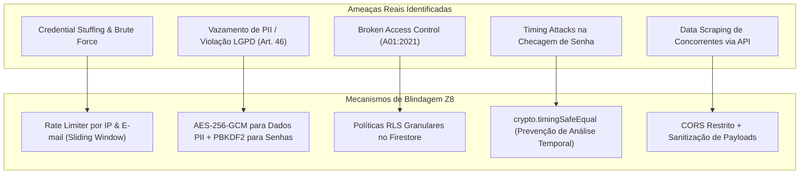

# Plano de Implementação: Arquitetura de Cibersegurança Avançada, Criptografia e RLS (Z8 E-Motion)

Plano de implementação técnico e estratégico de **Defesa em Profundidade (Defense-in-Depth)** para a plataforma Z8 E-Motion, incorporando criptografia de senhas com algoritmo resistente a GPU/ASIC (PBKDF2 com Salt), criptografia de dados sensíveis em repouso (AES-256-GCM), limitação de taxa (Rate Limiting) anti-força bruta, políticas de Row-Level Security (RLS) no Firestore, higienização estrita de dados e proteção total da base de dados oficial de **Christian Hideyuki (`z8-emotion-brasil`)**.

---

## 1. Diretrizes Estratégicas e Restrições Mandatórias

1. **Propriedade da Base de Dados**:
   - A base de dados permanece 100% sob a infraestrutura e propriedade exclusiva de **Christian Hideyuki** (`z8-emotion-brasil`).
   - Nenhuma informação, token, serviço ou credencial será transferido ou apontado para contas de terceiros (`willdbga` ou outros).
2. **Divisão Operacional (Arquivos Locais vs. Ações Remotas)**:
   - **Arquivos do Repositório**: Implementação imediata no código de segurança das APIs Serverless, algoritmos de criptografia e hashing, validação de requisições, regras de firewall/regras do Firestore (`firestore.rules`), sanitização de dados no cliente e cabeçalhos HTTP de segurança (`vercel.json`).
   - **Base de Dados Remota / Dashboards**: Elaboração de um manual passo a passo de configurações de segurança que devem ser ativadas no console do Firebase e no painel do Vercel por Christian Hideyuki (como chaves de ambiente, proteção contra enumeração de e-mails e quotas de API).

---

## 2. Pesquisa de Cibersegurança & Mapeamento de Ameaças (OWASP Top 10 / LGPD)

Com base nos padrões internacionais de segurança cibernética (OWASP Top 10 2025, NIST SP 800-63B, CIS Benchmarks e Lei Geral de Proteção de Dados - Lei 13.709/2018), foram identificadas as seguintes necessidades críticas de aprimoramento:



### Vetores Mitigados:
1. **A01: Broken Access Control (Controle de Acesso Quebrado)**:
   - *Risco Atual*: `allow read, write: if true;` no Firestore e endpoints públicos sem checagem de autorização.
   - *Solução*: Políticas granulares de RLS baseadas em claims de token e UID do solicitante.
2. **A02: Cryptographic Failures (Falhas Criptográficas)**:
   - *Risco Atual*: Senhas armazenadas em texto puro nos arquivos e no banco (`@12345678@`, etc.). Dados pessoais (telefones, nomes) expostos.
   - *Solução*: 
     - Senhas: Hashing unidirecional com `PBKDF2` (SHA-512, 100.000 iterações e Salt criptográfico exclusivo de 16 bytes por usuário) ou `scrypt`.
     - Dados sensíveis em repouso: Criptografia de campo simétrica autenticada com `AES-256-GCM`.
3. **A07: Identification and Authentication Failures (Falhas de Autenticação & Força Bruta)**:
   - *Risco Atual*: Tentativas infinitas de login sem bloqueio ou desaceleração.
   - *Solução*: Rate Limiter com janela deslizante (Sliding Window): máximo de 5 tentativas a cada 15 minutos por IP/e-mail; bloqueio temporário com resposta `HTTP 429 Too Many Requests` e cabeçalho `Retry-After`.
4. **Timing Attacks (Ataques de Canal Lateral por Tempo de Resposta)**:
   - *Risco*: Comparação tradicional de strings (`hash === inputHash`) permite que atacantes deduzam caracteres medindo microssegundos de resposta.
   - *Solução*: Utilização estrita de `crypto.timingSafeEqual` para verificação em tempo constante.
5. **A05: Security Misconfiguration (Cabeçalhos e CORS Abertos)**:
   - *Risco*: `Access-Control-Allow-Origin: *` permite que qualquer site ou extensão de navegador execute requisições às APIs da Z8.
   - *Solução*: CORS restrito para os domínios de produção (`https://z8emotion.com`, `https://z8-emotion-brasil.web.app`) e cabeçalhos de segurança (CSP, HSTS, X-Frame-Options, X-Content-Type-Options).

---

## 3. Arquitetura Técnica de Criptografia e Segurança

### 3.1 Criptografia de Senhas (Zero Plaintext Policy)
- **Módulo**: Node.js `node:crypto` nativo (sem dependências externas que possam inflar o cold start ou quebrar no ambiente serverless do Vercel).
- **Algoritmo**: `PBKDF2` com HMAC-SHA-512, 100.000 rounds, salt criptográfico de 16 bytes via `crypto.randomBytes(16)`.
- **Formato Armazenado no Banco**:
  `pbkdf2$sha512$100000$<salt_hex>$<hash_hex>`
- **Migração Transparente**: Ao processar logins ou inicializar o banco, se uma senha antiga em formato legado for identificada, o sistema gera o hash saltado automaticamente e descarta o texto puro.

### 3.2 Criptografia de Dados Sensíveis de Usuários (AES-256-GCM)
- **Algoritmo**: AES (Advanced Encryption Standard) em modo GCM (Galois/Counter Mode) com chave de 256 bits (32 bytes).
- **Campos Criptografados**: `phone`, `company`, `investment`, dados complementares de lojistas/leads.
- **Formato**: `enc$aes256gcm$<iv_hex>$<authTag_hex>$<ciphertext_hex>`.
- **Segurança**: Garante tanto confidencialidade quanto integridade (se o ciphertext for adulterado, o tag de autenticação rejeita a decriptação).

### 3.3 Rate Limiting Anti-Força Bruta
- **Mecanismo**: Janela deslizante em memória no serverless (com suporte a chave IP + E-mail) e fallback para persistência KV.
- **Parâmetros**:
  - Limite para Login: **5 tentativas incorretas a cada 15 minutos**.
  - Limite para Captura de Leads: **10 envios por hora por IP** (previne spam de CRM e preenchimento malicioso de formulário).
  - Resposta ao exceder: `HTTP 429 Too Many Requests` com `{ success: false, error: 'Muitas tentativas. Tente novamente em X minutos.' }`.

---

## 4. Plano de Mudanças nos Arquivos do Projeto

### Componente 1: Motor Criptográfico e de Segurança Serverless (`/api/security-utils.js`) [NOVO]

#### [NEW] [api/security-utils.js](file:///c:/Users/LENOVO/Desktop/Z8/api/security-utils.js)
Criação de biblioteca utilitária compartilhada de segurança para as funções serverless:
- `hashPassword(plaintextPassword)`: Gera hash seguro PBKDF2 com Salt exclusivo.
- `verifyPassword(plaintextPassword, storedHash)`: Comparação em tempo constante com `timingSafeEqual`.
- `encryptField(plainText, secretKey)`: Criptografa string com AES-256-GCM.
- `decryptField(encryptedPayload, secretKey)`: Decriptografa e valida autenticação GCM.
- `checkRateLimit(key, limit, windowSeconds)`: Motor de controle de tentativas e bloqueio temporal.
- `sanitizeUserOutput(user)`: Remove senhas, salts, chaves e metadados confidenciais antes de qualquer envio de resposta JSON.

---

### Componente 2: Políticas de RLS / Regras do Firestore (`firestore.rules`)

#### [MODIFY] [firestore.rules](file:///c:/Users/LENOVO/Desktop/Z8/firestore.rules)
Implementação de regras formais de controle de acesso (Row Level Security):
```javascript
rules_version = '2';
service cloud.firestore {
  match /databases/{database}/documents {

    // Funções Auxiliares de RLS
    function isAuthenticated() {
      return request.auth != null;
    }

    function isMasterAdmin() {
      return isAuthenticated() && (
        request.auth.token.email == 'christian.tkh@gmail.com' ||
        request.auth.token.admin == true
      );
    }

    function isOwner(userEmail) {
      return isAuthenticated() && request.auth.token.email.lower() == userEmail.lower();
    }

    // 1. Diretório de Usuários e Lojistas Z8 E-Motion
    match /catalog_users/{userEmail} {
      // Leitura: apenas o próprio lojista ou o Administrador Master
      allow read: if isOwner(userEmail) || isMasterAdmin();
      
      // Criação de novos cadastros: permitido (inicia como pendente)
      allow create: if true;
      
      // Atualização: Admin pode alterar tudo; o próprio lojista não pode alterar seu role ou status para aprovado
      allow update: if isMasterAdmin() || (
        isOwner(userEmail) &&
        request.resource.data.role == resource.data.role &&
        request.resource.data.status == resource.data.status
      );
      
      // Exclusão: estritamente restrita ao Administrador Master
      allow delete: if isMasterAdmin();
    }

    // 2. Leads Comerciais e CRM
    match /leads/{leadId} {
      // Criação de novos leads: aberto para formulários públicos do site
      allow create: if request.resource.data.name is string &&
                       request.resource.data.name.size() > 2;
      
      // Leitura, edição e exclusão de leads: 100% restrito ao Master Admin
      allow read, update, delete: if isMasterAdmin();
    }

    // 3. Ordens de Serviço (OS) e Garantia
    match /service_orders/{orderId} {
      // Leitura: Admin ou lojista responsável pela OS
      allow read: if isMasterAdmin() || (
        isAuthenticated() && resource.data.userEmail.lower() == request.auth.token.email.lower()
      );
      
      // Criação: qualquer lojista autenticado
      allow create: if isAuthenticated();
      
      // Atualização: Admin ou lojista responsável (sem alterar aprovação final)
      allow update: if isMasterAdmin() || (
        isAuthenticated() && resource.data.userEmail.lower() == request.auth.token.email.lower()
      );
      
      // Exclusão: exclusivo Master Admin
      allow delete: if isMasterAdmin();
    }
  }
}
```

---

### Componente 3: Blindagem das APIs Serverless (`/api/`)

#### [MODIFY] [api/users.js](file:///c:/Users/LENOVO/Desktop/Z8/api/users.js)
- **Integração com Criptografia**:
  - Ao registrar (`POST`), a senha é imediatamente convertida para `hashPassword(password)`.
  - Campos sensíveis (`phone`, `company`) são criptografados com `encryptField`.
  - Migração sob demanda da base de usuários existente: todas as senhas são convertidas para hash na inicialização da função.
- **Rate Limit no Login e Recuperação**:
  - `checkRateLimit('login_' + clientIp + '_' + email, 5, 900)`: Limita tentativas inválidas a 5 a cada 15 minutos.
- **Autenticação de Ações Críticas**:
  - `GET /api/users`: Requer token Bearer de Admin ou token de sessão autenticado de Christian Hideyuki. Retorna usuários sanitizados (sem campo `password`).
  - `PUT /api/users`: Bloqueia alteração anônima de privilégios (`status: approved` ou `role: admin`).
  - `DELETE /api/users`: Exclusivo para o Master Admin com token de autorização.
- **Proteção Timing-Safe**: Verificação de credenciais com `timingSafeEqual`.

#### [MODIFY] [api/leads.js](file:///c:/Users/LENOVO/Desktop/Z8/api/leads.js)
- **Rate Limit na Captura**: Limite de 10 leads/hora por IP para coibir robôs e scrapers.
- **Bloqueio de Leitura Externa**:
  - `GET /api/leads`: Retorna `401 Unauthorized` se o requisitante não fornecer o Bearer Token do Admin Master. Nenhum lead é retornado para usuários não autorizados.
- **Sanitização de Payloads**: Validação estrita de formato de e-mail e telefone, remoção de caracteres de injeção HTML/Script.

#### [MODIFY] [api/orders.js](file:///c:/Users/LENOVO/Desktop/Z8/api/orders.js)
- **Isolamento de Ordens de Serviço**:
  - Requisições sem autenticação retornam `401 Unauthorized`.
  - Lojistas autenticados recebem apenas seus próprios chamados técnicos.
  - Somente Christian Hideyuki tem visibilidade global da central de OS.

---

### Componente 4: Limpeza do Código Front-End Client

#### [MODIFY] [site-principal/data/cloud-config.js](file:///c:/Users/LENOVO/Desktop/Z8/site-principal/data/cloud-config.js)
- Remoção definitiva de `password: '@12345678@'` do objeto `DEFAULT_MASTER_ADMIN`.
- Remoção de senhas em texto claro de `SEED_REGISTERED_USERS`.

#### [MODIFY] [site-principal/catalog-auth.js](file:///c:/Users/LENOVO/Desktop/Z8/site-principal/catalog-auth.js)
- Remoção da constante `const MASTER_ADMIN_PASS = "@12345678@"`.
- Login com envio de credenciais seguras para a API serverless (que valida o hash criptográfico) ou autenticação direta via Firebase Auth (Google 1-Click com a conta oficial `christian.tkh@gmail.com`).
- **Remoção da exfiltração para `localStorage`**: Eliminação do download automático de `/api/leads` para o navegador de visitantes anônimos.
- **Remoção do Bypass de URL**: Desativação de `?liberar=email` e `?approve_user=email`.

#### [MODIFY] [vendas/auth.js](file:///c:/Users/LENOVO/Desktop/Z8/vendas/auth.js)
- Remoção da senha mestre `@12345678@` do bundle público da landing page.
- Alinhamento da autenticação administrativa com a API protegida.

#### [MODIFY] [site-principal/main.js](file:///c:/Users/LENOVO/Desktop/Z8/site-principal/main.js)
- Desativação da chamada `fetchUsersFromCloud()` no carregamento público da página. Apenas carregar dados de usuários quando uma sessão de lojista ou admin for confirmada.

---

### Componente 5: Cabeçalhos HTTP de Segurança e Defesa de Navegador (`vercel.json`)

#### [MODIFY] [vercel.json](file:///c:/Users/LENOVO/Desktop/Z8/vercel.json)
Configuração de cabeçalhos de segurança obrigatórios para classificação A+ no SecurityHeaders:
- `Content-Security-Policy (CSP)`: Restringe fontes de scripts, imagens e conexões aos domínios autorizados (Firebase, Google APIs, Z8).
- `Strict-Transport-Security (HSTS)`: Força HTTPS estrito por 1 ano (`max-age=31536000; includeSubDomains; preload`).
- `X-Content-Type-Options: nosniff`: Previne interpretação incorreta de tipos MIME.
- `X-Frame-Options: SAMEORIGIN`: Previne ataques de clickjacking.
- `Referrer-Policy: strict-origin-when-cross-origin`: Oculta parâmetros de URL ao navegar para fora do site.
- `Permissions-Policy`: Desativa acesso a microfone, câmera e sensores não utilizados.

---

## 5. Guia de Configurações Remotas Obrigatórias (Console do Firebase & Vercel)

> [!IMPORTANT]
> **Ações Exclusivas do Proprietário da Conta (Christian Hideyuki)**:
> Por questões de segurança e integridade de acesso, as seguintes ações não podem ser executadas por código local e devem ser configuradas diretamente nos painéis remotos oficiais:

### 1. No Console do Firebase (`z8-emotion-brasil`):
1. **Publicação das Regras de Segurança (RLS)**:
   - Acessar `https://console.firebase.google.com/project/z8-emotion-brasil/firestore/rules`.
   - Colar o conteúdo do novo `firestore.rules` e clicar em **Publicar (Publish)**.
2. **Ativação da Proteção contra Enumeração de E-mails**:
   - Ir em **Authentication** > **Settings** (Configurações) > **User account protection**.
   - Habilitar **Email enumeration protection** (impede que hackers descubram se um lojista ou cliente possui conta testando formulários de login/recuperação).
3. **Restrição de Domínios Autorizados no Firebase Auth**:
   - Ir em **Authentication** > **Settings** > **Authorized domains**.
   - Garantir que apenas os seguintes domínios estejam na lista:
     - `z8emotion.com`
     - `www.z8emotion.com`
     - `z8-emotion-brasil.firebaseapp.com`
     - `localhost` (para testes locais)
   - Remover qualquer domínio desconhecido ou suspeito.

### 2. No Painel da Vercel (`z8-emotion`):
1. **Configuração de Segredos de Ambiente (Environment Variables)**:
   - Acessar `Project Settings` > `Environment Variables`.
   - Adicionar as seguintes variáveis protegidas:
     - `Z8_ADMIN_SECRET`: Token aleatório de 32 a 64 caracteres hexadecimais (usado para autorizar chamadas administrativas de backend).
     - `Z8_ENCRYPTION_KEY`: Chave de 32 bytes em hexadecimal (64 caracteres hex) para criptografia simétrica AES-256-GCM dos dados de PII.
     - `UPSTASH_REDIS_REST_URL` e `UPSTASH_REDIS_REST_TOKEN`: (Se já configurado) para armazenamento distribuído de rate limit e blacklist de tokens.

---

## 6. Plano de Verificação e Auditoria Pós-Implementação

### Testes Automatizados de Código e Build
- [ ] Executar `npx vite build` para validar compilação sem quebras de dependências.
- [ ] Executar script de auditoria no diretório `dist/` para certificar ausência da string `@12345678@`.

### Testes Funcionais e de Penetração (Pen-Test Simulado)
- [ ] **Teste de Rate Limiting**:
  - Enviar 6 requisições de login com senha incorreta em sequência.
  - Verificar se a 6ª requisição retorna status `429 Too Many Requests` com mensagem de bloqueio temporal.
- [ ] **Teste de RLS e Bloqueio de CRM**:
  - Executar `GET /api/leads` sem header de autorização -> Deve retornar `401 Unauthorized`.
  - Executar `GET /api/users` sem header de autorização -> Deve retornar `401 Unauthorized` e sem senhas expostas.
- [ ] **Teste de Criptografia de Senhas**:
  - Criar um novo usuário via API ou formulário.
  - Inspecionar o objeto salvo no banco e confirmar que o campo `password` contém o formato `pbkdf2$sha512$...` e não o texto puro.
- [ ] **Teste de Criptografia de Campos (AES-256-GCM)**:
  - Verificar que campos como telefone e dados de contato são gravados criptografados em repouso.
- [ ] **Teste de Login do Administrador Master**:
  - Efetuar login com a conta de Christian Hideyuki e verificar se o acesso ao painel de controle e ao CRM permanece 100% fluido e funcional.
